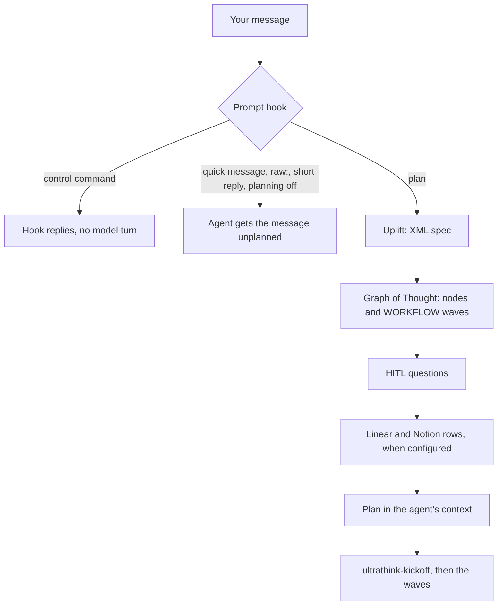

# ultrathink

ultrathink is a planner plugin for coding agents. Before the agent sees a non-trivial prompt, ultrathink rewrites it into an XML spec, builds a Graph of Thought that ends in a WORKFLOW of parallel waves, drafts the clarifying questions whose answers would change the work, and, if you configure it, creates matching Linear issues and Notion rows. The agent then starts from that plan. It runs on Claude Code, Grok Build, Hermes Agent, Muse Code and Omp, plans with Claude by default or with Grok if you choose, and fails open: a problem inside ultrathink never blocks your prompt.

[](LICENSE)
[](https://github.com/swcstudiospace/claude-ultrathink/actions/workflows/ci.yml)

## Why

A coding agent starts on the prompt exactly as typed. For anything larger than a one-line fix, the scope, the order of the work and the questions worth settling first are left for the agent to work out as it goes, and whatever plan it forms stays inside that one session. ultrathink adds one planning pass in front of the agent: a written spec, a dependency graph whose independent parts can run in parallel, the blocking questions asked once up front, and, if you want them, tracker rows for every part of the plan. One engine and one config serve all five hosts.

## What happens on a prompt

1. **Filter.** The host's prompt hook runs before the model sees your message. It handles the `/ultrathink-*` commands and lets these through unplanned: `/ultrathink-quick` and `raw:` messages, short replies such as `ok` or `lgtm`, slash commands that are not skills, subagent sessions, and everything while planning is off. A skill invocation is planned together with the text you typed.
2. **Uplift.** The engine rewrites the message into an XML spec. Your own words stay verbatim in its `ORIGINAL` element.
3. **Graph of Thought.** The engine splits the work into 5 to 8 nodes (by default) with dependencies and gives each node a rationale and a conclusion. The final node writes a WORKFLOW: waves of file-disjoint units, where the units of one wave can run in parallel.
4. **Clarify.** It drafts up to 4 HITL questions. The agent first tries to answer them from the repository; blocking questions that remain are asked once, before any code is written, and the rest go ahead with their recommended default.
5. **Track (optional).** For each provider that is configured and logged in, it creates rows through the shared MCP gateway: a Notion Task row for the prompt, a Linear issue and a Notion Issue row per node, and a Linear sub-issue and a Notion Sub-Issue row per rationale step. A node's Linear issue is blocked by the issues of the nodes it depends on.
6. **Inject.** It saves the spec and session state in the host's state directory and puts the plan into the agent's context.
7. **Execute.** With tracking on, the agent first runs `ultrathink-kickoff`. Then it works through the waves: the plan tells it to run the units of a wave as parallel subagents, to verify each wave before starting the next, and to prefer repository evidence where the plan disagrees with it.



Each step fails open. If the engine fails, the agent gets a conservative spec and nothing is tracked. If a tracker fails, the plan still arrives and `ultrathink-kickoff` tries the missing rows again. If Bun is missing, the hooks exit quietly and the prompt goes through unplanned.

The agent-side half is four skills, shared by every host:

| Skill | Runs | Does |
|---|---|---|
| `ultrathink-kickoff` | First, when tracking is on | Finishes missing tracker rows, resolves blocking questions, hands back the full spec and the linked TODO lines |
| `ultrathink-plan` | On a host that drops hook output (Grok Build) | Reads the plan from `last-plan.json`, then runs kickoff |
| `ultrathink-sync` | After a pull request opens, or at a stopping point | Puts the PR link, checks and status on the tracked rows; never creates rows |
| `ultrathink-ship` | After a planned GSD skill run | Done check, pull request, Greptile review to 5/5, squash-merge, branch cleanup (see [Ship](#ship)) |

## Supported hosts

Each host was tested live with the version shown, including planning and the `/ultrathink-*` commands described under [Skip ultrathink for quick messages](#skip-ultrathink-for-quick-messages).

| Host | Tested | How ultrathink loads | How the plan reaches the agent |
|---|---|---|---|
| Claude Code | 2.1.278 | `.claude-plugin/` marketplace; hooks in `hooks/hooks.json` | `UserPromptSubmit` hook context |
| Grok Build | 1.0.41 | The plugin directory supplies the skills and commands. Grok does not dispatch plugin hooks, so `bun scripts/setup.ts apply` installs the global hook file `~/.grok/hooks/ultrathink.json` | Grok discards hook output, so the plan is written to `last-plan.json` and a rule file (`~/.grok/rules/ultrathink.md`) tells the model to read it |
| Hermes Agent | v0.21.4 | Python plugin `hosts/hermes`, symlinked into `~/.hermes/plugins/ultrathink` | `pre_llm_call` returns the plan from `hooks/engine.ts` |
| Muse Code | 1.4.0 | `.muse-plugin/plugin.json` | `UserPromptSubmit` hook context, same entry as Claude Code |
| Omp | 18.3.1 | `package.json` `omp.extensions` → `src/host/omp.ts` | `before_agent_start`; the TUI shows a live status bar and plan cards. Omp caps a handler at 30 s, so the extension waits up to 25 s and a slower plan arrives later as an aside |

Requirements:

- **Bun 1.2 or newer** (tested with 1.4.0). `bin/run-bun` finds Bun even when a host's PATH does not include it.
- **An engine:** the default Claude engine runs the `claude` CLI on every host, so it must be installed and logged in. The optional Grok engine needs `grok login` instead.
- **For ship:** `gh`, authenticated, and Greptile: the gateway's Greptile key when Greptile indexes the repository, otherwise the Greptile CLI (tested with 3.4.1) after `greptile login`.

State is kept per host: `~/.claude/ultrathink`, `~/.grok/plugin-data/ultrathink`, `$HERMES_HOME/ultrathink` (default `~/.hermes/ultrathink`), `~/.config/muse/ultrathink` and `~/.omp/agent/ultrathink`. Planning never writes `.planning/` into your working directory.

## Quickstart

Clone the repository once; every host loads ultrathink from the clone, written `<clone>` below. The runtime has no npm dependencies, so `bun install` is only needed for development.

```bash
git clone https://github.com/swcstudiospace/claude-ultrathink.git <clone>
```

Then run the lines for each host you use:

```bash
# Claude Code
claude plugin marketplace add <clone>
claude plugin install ultrathink@ultrathink

# Grok Build: the plugin directory, then the global hook file and rule file
mkdir -p ~/.grok/plugins && ln -sfn <clone> ~/.grok/plugins/ultrathink
bun <clone>/scripts/setup.ts apply

# Hermes Agent
mkdir -p ~/.hermes/plugins && ln -sfn <clone>/hosts/hermes ~/.hermes/plugins/ultrathink
hermes plugins enable ultrathink

# Muse Code
muse plugins install <clone> --scope user
muse plugins approve ultrathink

# Omp
omp plugin link <clone>
```

- `setup.ts apply` installs the Grok hook file and rule first. If the `claude` CLI is on PATH, it also sets up Claude Code: it installs the plugin, adds the hosted Notion and Linear MCP servers and adds a marked block to `~/.claude/CLAUDE.md`. Without `claude`, it skips those steps and says so.
- Muse refuses a plugin directory that contains symlinks, and `bun install` can create some under `node_modules/.bin`, so install from a clone where you have not run it (or delete `node_modules` first). The `multiple-manifests` warning is expected: Muse uses `.muse-plugin/plugin.json` and ignores the Claude manifest. Planning starts only after `approve`.
- Check the result with `<clone>/bin/ultrathink status`, then send a request. In Claude Code a `Prompt Uplift · …` line appears before the agent starts.

Per-host details: [Claude Code](docs/install.md#claude-code) (including the GitHub marketplace, no clone needed), [Grok Build](docs/install.md#grok-build), [Hermes Agent](docs/install.md#hermes-agent), [Muse Code](docs/install.md#muse-code), [Omp](docs/install.md#omp).

### Optional: track plans in Linear and Notion

Tracking stays off until you configure a provider, and rows are created only for the providers you set up. The Notion, Linear and Greptile credentials live in one store that every host shares (`~/.config/ultrathink/mcp-credentials.json`, mode 0600).

```bash
cd <clone>

# Linear: store an API key (paste it, then Ctrl-D), then set linear.team (see Configuration)
bin/ultrathink-mcp auth set-key linear --stdin

# Notion: OAuth, then create the tracking database and save it to your config
bin/ultrathink-mcp auth login notion
bin/ultrathink-mcp notion init --parent <notion page url or id> --write-config

# Greptile, used by ship
bin/ultrathink-mcp auth set-key greptile --stdin

bin/ultrathink-mcp auth status   # which providers are ready
bun scripts/mcp-register.ts      # register the gateway in each host (--hosts to choose, --dry-run to preview)
```

`mcp-register` gives each host's agent the Notion, Linear and Greptile tools that the kickoff and sync skills use; the planner itself reads the credential store directly. For a Notion login on a remote machine over SSH, see [docs/tracking.md](docs/tracking.md#logging-in-from-a-remote-machine).

## Skip ultrathink for quick messages

The same commands work on every host. Nothing changes unless you use one.

| Command | Effect |
|---|---|
| `/ultrathink-quick <message>` | Sends only this message to the agent: no planning, no Linear/Notion rows |
| `/ultrathink-skip` | Your next message is not planned |
| `/ultrathink-off`, `/ultrathink-on` | Planning off or on for this host until you change it |
| `/ultrathink-track off`, `/ultrathink-track on` | Keep planning, but stop or start creating Linear/Notion rows |
| `/ultrathink-status` | Show the planning, tracking and engine state |

- The prompt hook answers every command except `quick` before any model turn. Claude Code, Grok Build and Muse Code block the prompt and show the reply; Omp shows a notification; Hermes replies inline.
- Claude Code also lists them as `/ultrathink:ultrathink-<verb>`, and still accepts the older `/ultrathink:<verb>`.
- In a Hermes gateway, `/ultrathink-quick` needs `plugins.entries.ultrathink.allow_gateway_injection: true`; without it, the command skips your next message instead. Telegram menus list the commands with underscores, such as `ultrathink_status`.
- Start a message with `raw:` to send it without planning, or with `uplift:` to plan it even while planning is off.
- From a shell, `<clone>/bin/ultrathink status`, `off`, `on`, `skip` and `track off|on` do the same. `ULTRATHINK_HOST` (`claude-code`, `grok-build`, `hermes`, `muse`, `omp`) picks the host whose state they change.

Per-host behavior and environment variables: [docs/commands.md](docs/commands.md).

## Ship

When a planned run of a GSD skill (by default, a skill whose name starts with `gsd-`) ends with committed work on a feature branch, ultrathink tells the agent to run the `ultrathink-ship` skill. The skill first checks that the task is really done, from the git state, the GSD roadmap and verification status and a judge over the diff, and hands back to you if it is not. Otherwise it pushes the branch, opens a pull request into the default branch that GitHub reports, and runs Greptile reviews, fixing the findings between rounds, until the score is 5/5 with zero open comments. It merges (squash by default) only while the reviewed commit is still the PR head, the PR is mergeable and CI is neither failing nor pending, then deletes the branch and runs `ultrathink-sync`. After 5 review rounds (the default) without a pass, it stops, comments on the PR and leaves it open for a person. Turn it off with `"ship": { "enabled": false }` or `ULTRATHINK_SHIP=0`. The full flow and every setting: [docs/ship.md](docs/ship.md).

## Configuration

ultrathink runs with no config file. Every host reads the same JSON files, and later files win key by key:

1. `~/.config/ultrathink/config.json` (`$XDG_CONFIG_HOME/ultrathink/config.json` when that is set)
2. `~/.claude/ultrathink.json` (`$CLAUDE_CONFIG_DIR/ultrathink.json` when that is set)
3. `<project>/.claude/ultrathink.json`

A minimal file that turns on tracking for both providers:

```json
{
  "linear": { "team": "<your Linear team name>" },
  "notion": { "dataSourceUrl": "collection://<data source id>" }
}
```

Neither provider is configured by default. To plan with Grok instead of Claude, add `"think": { "engine": "grok" }` and run `grok login`. Without a Grok login, planning is skipped instead of silently switching to Claude, unless you set `"grok": { "fallbackToClaude": true }`.

| Variable | Effect |
|---|---|
| `ULTRATHINK_UPLIFT=0` | No planning in this process, for scripts and headless runs |
| `ULTRATHINK_TRACK=0` | The planner creates no rows; `ultrathink-kickoff` still creates them. `/ultrathink-track off` stops both |
| `ULTRATHINK_SHIP=0` | No ship flow |

Every key and its default: [docs/configuration.md](docs/configuration.md).

## Documentation

| Document | Covers |
|---|---|
| [docs/install.md](docs/install.md) | Installing, checking, updating and removing ultrathink on each host; the shared MCP gateway; choosing the engine |
| [docs/commands.md](docs/commands.md) | The `/ultrathink-*` commands on each host, the `raw:` and `uplift:` prefixes, `bin/ultrathink`, environment variables |
| [docs/configuration.md](docs/configuration.md) | Config files, every key and its default |
| [docs/tracking.md](docs/tracking.md) | Linear and Notion setup and the rows ultrathink creates |
| [docs/ship.md](docs/ship.md) | The done check, pull request, Greptile review loop and merge gate |
| [docs/architecture.md](docs/architecture.md) | How the engine, host entries, skills and gateway fit together |
| [docs/troubleshooting.md](docs/troubleshooting.md) | Common problems and how to diagnose them |

## Contributing, security and conduct

- [CONTRIBUTING.md](CONTRIBUTING.md): development setup, checks and pull requests.
- [SECURITY.md](SECURITY.md): report vulnerabilities privately; how credentials are stored.
- [CODE_OF_CONDUCT.md](CODE_OF_CONDUCT.md): the Contributor Covenant, which everyone taking part follows.
- [CHANGELOG.md](CHANGELOG.md): release notes. 0.3.0 is the first public release.

## License

Copyright (C) 2026 SWC Studio

This program is free software: you can redistribute it and/or modify it under the terms of the GNU Affero General Public License as published by the Free Software Foundation, either version 3 of the License, or (at your option) any later version.

This program is distributed in the hope that it will be useful, but WITHOUT ANY WARRANTY; without even the implied warranty of MERCHANTABILITY or FITNESS FOR A PARTICULAR PURPOSE. See the GNU Affero General Public License for more details.

You should have received a copy of the GNU Affero General Public License along with this program. If not, see <https://www.gnu.org/licenses/>. See [LICENSE](LICENSE) for the full text.
