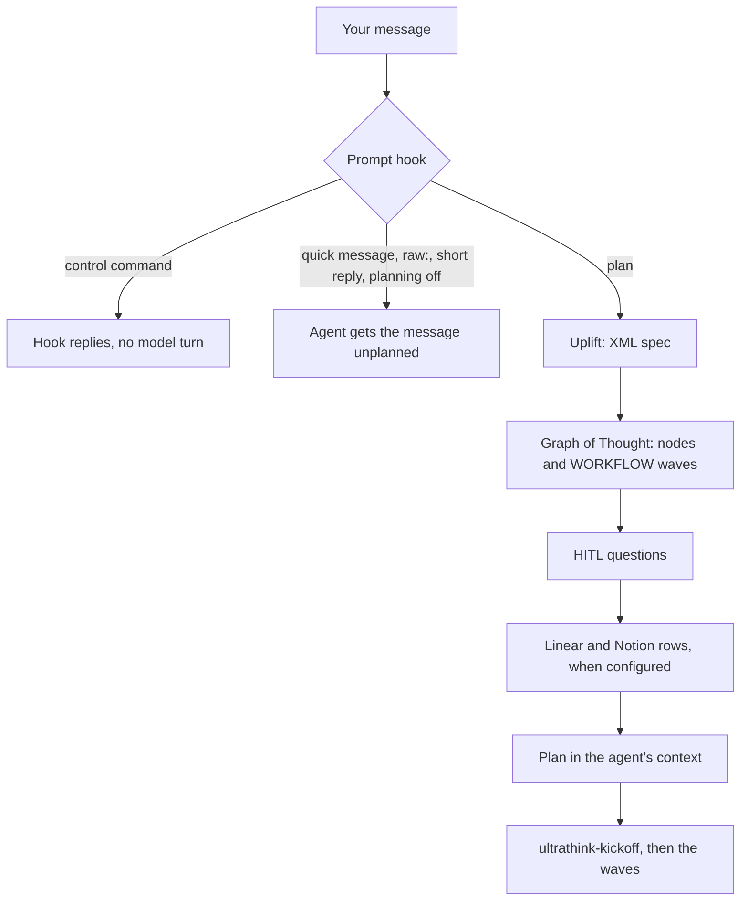

# ultrathink

ultrathink is a planner plugin for coding agents. Before the agent sees a non-trivial prompt, ultrathink rewrites it into an XML spec, builds a Graph of Thought that ends in a WORKFLOW of parallel waves, drafts the clarifying questions whose answers would change the work, and, if you configure it, creates matching Linear issues and Notion rows. The agent then starts from that plan. It runs on Claude Code, Grok Build, Hermes Agent, Muse Code and Omp, plans with Claude by default or with Grok if you choose, and fails open: a problem inside ultrathink never blocks your prompt.

[](LICENSE)
[](https://github.com/swcstudiospace/claude-ultrathink/actions/workflows/ci.yml)

**New here?** Follow [Getting started](docs/getting-started.md) to install ultrathink and plan your first prompt. Everything else is in the [documentation index](docs/README.md).

## Why

A coding agent starts on the prompt exactly as typed. For anything larger than a one-line fix, the scope, the order of the work and the questions worth settling first are left for the agent to work out as it goes, and whatever plan it forms stays inside that one session. ultrathink adds one planning pass in front of the agent: a written spec, a dependency graph whose independent parts can run in parallel, the blocking questions asked once up front, and, if you want them, tracker rows for every part of the plan. One engine and one config serve all five hosts.

## What happens on a prompt

1. **Filter.** The host's prompt hook runs before the model sees your message. It handles the `/ultrathink-*` commands and lets these through unplanned: `/ultrathink-quick` and `raw:` messages, short replies such as `ok` or `lgtm`, slash commands that are not skills, subagent sessions, and everything while planning is off. A skill invocation is planned together with the text you typed.
2. **Uplift.** The engine rewrites the message into an XML spec. Your own words stay verbatim in its `ORIGINAL` element.
3. **Graph of Thought.** The engine splits the work into 5 to 8 nodes (by default) with dependencies and gives each node a rationale and a conclusion. The final node writes a WORKFLOW: waves of file-disjoint units, where the units of one wave can run in parallel.
4. **Clarify.** It drafts up to 4 HITL questions. The agent first tries to answer them from the repository; blocking questions that remain are asked once, before any code is written, and the rest go ahead with their recommended default.
5. **Track (optional).** For each provider that is configured and logged in, it creates rows through the shared MCP gateway: a Notion Task row for the prompt, a Linear issue and a Notion Issue row per node, and a Linear sub-issue and a Notion Sub-Issue row per rationale step. A node's Linear issue is blocked by the issues of the nodes it depends on.
6. **Inject.** It saves the spec and session state in the host's state directory and puts the plan into the agent's context.
7. **Execute.** With tracking on, the agent first runs `ultrathink-kickoff`. Then it works through the waves: the plan tells it to run the units of a wave as parallel subagents, to verify each wave before starting the next, and to prefer repository evidence where the plan disagrees with it.



Each step fails open. If the engine fails, the agent gets a conservative spec and nothing is tracked. If a tracker fails, the plan still arrives and `ultrathink-kickoff` tries the missing rows again. If Bun is missing, the hooks exit quietly and the prompt goes through unplanned.

The agent-side half is four skills, shared by every host:

| Skill | Runs | Does |
|---|---|---|
| `ultrathink-kickoff` | First, when tracking is on | Finishes missing tracker rows, resolves blocking questions, hands back the full spec and the linked TODO lines |
| `ultrathink-plan` | On a host that drops hook output (Grok Build) | Reads the plan from `last-plan.json`, then runs kickoff |
| `ultrathink-sync` | After a pull request opens, or at a stopping point | Puts the PR link, checks and status on the tracked rows; never creates rows |
| `ultrathink-ship` | After a planned GSD skill run, only when ship is turned on | Done check, pull request, Greptile review to 5/5; merge and branch cleanup only when you enable them (see [Ship](#ship)) |

## Supported hosts

Each host was tested live with the version shown, including planning and the `/ultrathink-*` commands described under [Skip ultrathink for quick messages](#skip-ultrathink-for-quick-messages).

| Host | Tested | How ultrathink loads | How the plan reaches the agent |
|---|---|---|---|
| Claude Code | 2.1.278 | `.claude-plugin/` marketplace; hooks in `hooks/hooks.json` | `UserPromptSubmit` hook context |
| Grok Build | 1.0.41 | The plugin directory supplies the skills and commands. Grok does not dispatch plugin hooks, so `bun scripts/setup.ts apply` installs the global hook file `${GROK_HOME:-~/.grok}/hooks/ultrathink.json` | Grok discards hook output, so the plan is written to `last-plan.json` and a rule file (`${GROK_HOME:-~/.grok}/rules/ultrathink.md`) tells the model to read it |
| Hermes Agent | v0.21.4 | Python plugin `hosts/hermes` (Python 3.10 or later), symlinked into `${HERMES_HOME:-~/.hermes}/plugins/ultrathink` | `pre_llm_call` gets the plan from `hooks/engine.ts` and hands the agent a short handoff: the spec path, the state file and the Graph ID |
| Muse Code | 1.4.0 | `.muse-plugin/plugin.json` | `UserPromptSubmit` hook context, same entry as Claude Code |
| Omp | 18.3.1 | `package.json` `omp.extensions` → `src/host/omp.ts` | `before_agent_start`; the TUI shows a live status bar and plan cards. Omp caps a handler at 30 s, so the extension waits up to 25 s and a slower plan arrives later as an aside |

### Platforms

ultrathink runs on **Linux** and **macOS**. On Windows, use it inside **WSL**; native Windows is not supported. CI runs on Linux and macOS.

Requirements:

- **Bun 1.2 or newer** (tested with 1.4.0). `bin/run-bun` finds Bun even when a host's PATH does not include it. Without Bun the hooks exit quietly and prompts go through unplanned; the `bin/` CLIs print `ultrathink: bun not found` and exit with status 127.
- **An engine:** the default Claude engine runs the `claude` CLI (Claude Code 2.1.278 or later) on every host, so it must be installed and logged in. It passes `--tools ""`, `--strict-mcp-config` and `--exclude-dynamic-system-prompt-sections`; an older CLI rejects these and every plan falls back to the minimal spec. The optional Grok engine needs `grok login` instead.
- **Hermes Agent only:** Python 3.10 or newer.
- **For ship (optional):** `gh`, authenticated, and Greptile: a Greptile key in the gateway, or the Greptile CLI (tested with 3.4.1) after `greptile login`.

State is kept per host: `~/.claude/ultrathink`, `$GROK_PLUGIN_DATA/ultrathink` if set (otherwise `${GROK_HOME:-~/.grok}/plugin-data/ultrathink`), `$HERMES_HOME/ultrathink` (default `~/.hermes/ultrathink`), `~/.config/muse/ultrathink` and `~/.omp/agent/ultrathink`. Planning never writes `.planning/` into your working directory.

## Cost and latency

Planning is not free. For each prompt it plans, the engine makes one model call to write the spec, one to build the Graph of Thought, one per node to fill it in (5 to 8 nodes by default) and one for the clarifying questions: **8 to 11 headless model calls** on the configured engine. With the default Claude engine they run through your `claude` login, with model `sonnet` unless you set `claude.model`. Node fills run up to `claude.concurrency` (default 3) at a time within a dependency level; the other calls run one after another, and creating tracker rows can add up to `track.budgetMs` (60 s by default). The agent starts only when the plan is ready (on Omp, after 25 s at most; a slower plan arrives as an aside).

To spend less: send small messages with `/ultrathink-quick` or a `raw:` prefix, lower `think.maxNodes`, turn clarifying questions off with `hitl.enabled: false`, or turn the graph off with `think.enabled: false`. Short replies such as `ok` are not planned. See [Reduce cost and latency](docs/how-to/reduce-cost-and-latency.md).

## What leaves your machine

- **Always, for a planned prompt:** your message and the recent conversation go to the planning engine: Anthropic through the `claude` CLI by default, or xAI when you choose the Grok engine (or a gateway you run, with the Grok `shunt` transport).
- **Only when you configure them:** plan contents (the uplifted prompt, node titles and reasoning, repository name and branch) go to Notion and Linear through their hosted MCP servers; ship pushes to GitHub with `gh` and sends the pull request to Greptile; the Agent Substrate brief request sends the repository, branch and host name to the URL you set.
- Credentials for Notion, Linear and Greptile stay in one local file, `~/.config/ultrathink/mcp-credentials.json` (mode 0600). ultrathink has no telemetry of its own.

Details for every service: [What leaves your machine](docs/privacy.md).

## Optional integrations (off by default)

A fresh install plans prompts and contacts nothing but the engine. Each of these stays off until you turn it on:

| Integration | Turn it on with | What it does |
|---|---|---|
| Notion and Linear tracking | `notion.dataSourceUrl`, `linear.team` | Creates rows for each plan (see [Getting started](docs/getting-started.md#6-optional-track-plans-in-notion-or-linear)) |
| Ship | `ship.enabled: true`; merging also needs `ship.autoMerge: true`, branch deletion `ship.deleteBranch: true` | Opens a pull request after a GSD skill run and reviews it with Greptile (see [Ship](#ship)) |
| Agent Substrate brief | `substrate.url` or `SUBSTRATE_URL` | Fetches a cross-agent brief for the repository and branch before the graph is built |
| Tailscale OAuth callback | `bin/ultrathink-mcp auth login <provider> --tailscale` or `ULTRATHINK_OAUTH_TAILSCALE=1` | Receives the OAuth callback over `tailscale serve` for logins on a remote machine |
| Grok `shunt` transport | `grok.transport: "shunt"` plus `grok.shuntBaseUrl` | Sends Grok engine calls to an Anthropic-compatible gateway you run; there is no built-in one |

`bin/ultrathink status` shows tracking, Substrate, Ship and the Grok transport. Every key: [docs/configuration.md](docs/configuration.md).

## Quickstart

Clone the repository once; every host loads ultrathink from the clone, written `<clone>` below. The runtime has no npm dependencies, so `bun install` is only needed for development.

```bash
git clone https://github.com/swcstudiospace/claude-ultrathink.git <clone>
```

Then run the lines for each host you use:

```bash
# Claude Code
claude plugin marketplace add <clone>
claude plugin install ultrathink@ultrathink

# Grok Build: the plugin directory, enable it, then the global hook file and rule file
mkdir -p ${GROK_HOME:-~/.grok}/plugins && ln -sfn <clone> ${GROK_HOME:-~/.grok}/plugins/ultrathink
grok plugin enable ultrathink
grok plugin list                 # ultrathink should be listed as enabled
bun <clone>/scripts/setup.ts apply

# Hermes Agent: the plugin, then the hook cap (required, see below)
mkdir -p "${HERMES_HOME:-$HOME/.hermes}/plugins"
ln -sfn <clone>/hosts/hermes "${HERMES_HOME:-$HOME/.hermes}/plugins/ultrathink"
hermes plugins enable ultrathink
hermes config set plugins.hook_callback_timeout 600

# Muse Code
muse plugins install <clone> --scope user
muse plugins approve ultrathink

# Omp
omp plugin link <clone>
```

- **Hermes hook cap.** Hermes stops waiting for a plugin hook after `plugins.hook_callback_timeout` seconds, 30 by default, and a plan takes longer than that. ultrathink plans only when the cap is at least 105 s; 600 (Hermes' maximum) is recommended. It is a global Hermes setting that applies to every plugin, and ultrathink never changes it for you. Below 105 s, every prompt goes through unplanned and the Hermes log gets one warning naming the command above.
- `setup.ts apply` installs the Grok hook file and rule first. If the `claude` CLI is on PATH, it also sets up Claude Code: it installs the plugin, adds the hosted Notion and Linear MCP servers and adds a marked block to `~/.claude/CLAUDE.md`. Without `claude`, it skips those steps and says so.
- Muse refuses a plugin directory that contains symlinks, and `bun install` can create some under `node_modules/.bin`, so install from a clone where you have not run it (or delete `node_modules` first). Planning starts only after `approve`.
- Check the result with `<clone>/bin/ultrathink status`, then send a request. In Claude Code a `Prompt Uplift · …` line appears before the agent starts.

Per-host details, updating and removing: [docs/install.md](docs/install.md).

### Optional: track plans in Linear and Notion

Tracking stays off until you configure a provider, and rows are created only for the providers you set up. The short version, from `<clone>`:

```bash
bin/ultrathink-mcp auth login linear      # or: bin/ultrathink-mcp auth set-key linear --stdin
bin/ultrathink-mcp auth login notion
bin/ultrathink-mcp notion init --parent <notion page url or id> --write-config
bun scripts/mcp-register.ts               # give each host's agent the tracker tools
```

Then set `linear.team` to `<your Linear team name>` in `~/.config/ultrathink/config.json`. The walkthrough, with what each step prints: [Getting started](docs/getting-started.md#6-optional-track-plans-in-notion-or-linear). Guides: [Set up Notion](docs/how-to/set-up-notion.md), [Set up Linear](docs/how-to/set-up-linear.md), [Register the MCP gateway](docs/how-to/register-mcp-gateway.md).

## Skip ultrathink for quick messages

The same commands work on every host. Nothing changes unless you use one.

| Command | Effect |
|---|---|
| `/ultrathink-quick <message>` | Sends only this message to the agent: no planning, no Linear/Notion rows |
| `/ultrathink-skip` | Your next message is not planned |
| `/ultrathink-off`, `/ultrathink-on` | Planning off or on for this host until you change it |
| `/ultrathink-track off`, `/ultrathink-track on` | Keep planning, but stop or start creating Linear/Notion rows |
| `/ultrathink-status` | Show the planning, tracking and engine state |

Start a message with `raw:` to send it without planning, or with `uplift:` to plan it even while planning is off. From a shell, `<clone>/bin/ultrathink status`, `off`, `on`, `skip` and `track off|on` do the same. Per-host behavior, Claude Code's plugin-qualified names and environment variables: [docs/commands.md](docs/commands.md).

## Ship

Ship is off until you set `"ship": { "enabled": true }`. Then, when a planned run of a GSD skill (GSD, "Get Shit Done", is a family of `gsd-*` agent skills; any skill whose name starts with `gsd-` by default) ends with committed work on a feature branch, ultrathink tells the agent to run the `ultrathink-ship` skill. It checks that the task is really done, pushes the branch, opens a pull request into the default branch and runs Greptile reviews, fixing the findings between rounds, until the score is 5/5 with no open comments. It merges only with `ship.autoMerge: true` (otherwise it leaves the pull request for you) and deletes the branch only with `ship.deleteBranch: true`. `ULTRATHINK_SHIP=0` turns it off for one shell. Setup: [Ship with Greptile](docs/how-to/ship-with-greptile.md). The full flow and every setting: [docs/ship.md](docs/ship.md).

## Configuration

ultrathink runs with no config file. Every host reads the same JSON files, and later files win key by key:

1. `~/.config/ultrathink/config.json` (`$XDG_CONFIG_HOME/ultrathink/config.json` when that is set)
2. `~/.claude/ultrathink.json` (`$CLAUDE_CONFIG_DIR/ultrathink.json` when that is set)
3. `<project>/.claude/ultrathink.json`

To plan with Grok instead of Claude, add `"think": { "engine": "grok" }` and run `grok login` (see [Choose the engine](docs/how-to/choose-engine.md)). `ULTRATHINK_UPLIFT=0` turns planning off in one process, for scripts and headless runs. Every key, its default and every environment variable: [docs/configuration.md](docs/configuration.md).

## Documentation

Start with [Getting started](docs/getting-started.md). The [documentation index](docs/README.md) lists every guide and reference page: install per host, the how-to guides, configuration, commands, tracking, ship, architecture, privacy and troubleshooting.

## Contributing, security and conduct

- [CONTRIBUTING.md](CONTRIBUTING.md): development setup, checks and pull requests.
- [SECURITY.md](SECURITY.md): report vulnerabilities privately; how credentials are stored.
- [CODE_OF_CONDUCT.md](CODE_OF_CONDUCT.md): the Contributor Covenant, which everyone taking part follows.
- [CHANGELOG.md](CHANGELOG.md): release notes. 0.3.0 is the first public release.

## License

Copyright (C) 2026 SWC Studio

This program is free software: you can redistribute it and/or modify it under the terms of the GNU Affero General Public License as published by the Free Software Foundation, either version 3 of the License, or (at your option) any later version.

This program is distributed in the hope that it will be useful, but WITHOUT ANY WARRANTY; without even the implied warranty of MERCHANTABILITY or FITNESS FOR A PARTICULAR PURPOSE. See the GNU Affero General Public License for more details.

You should have received a copy of the GNU Affero General Public License along with this program. If not, see <https://www.gnu.org/licenses/>. See [LICENSE](LICENSE) for the full text.
