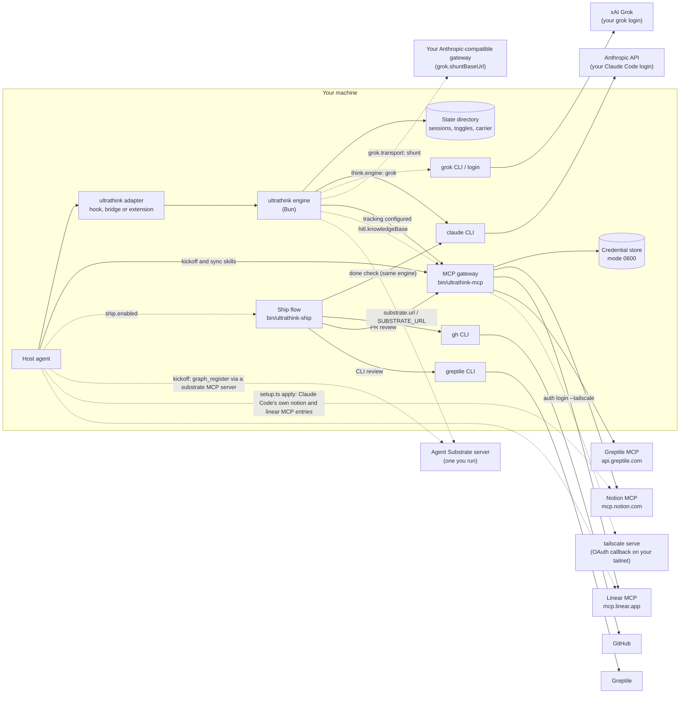
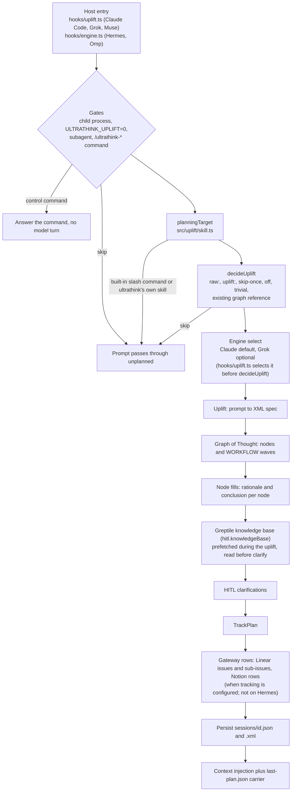
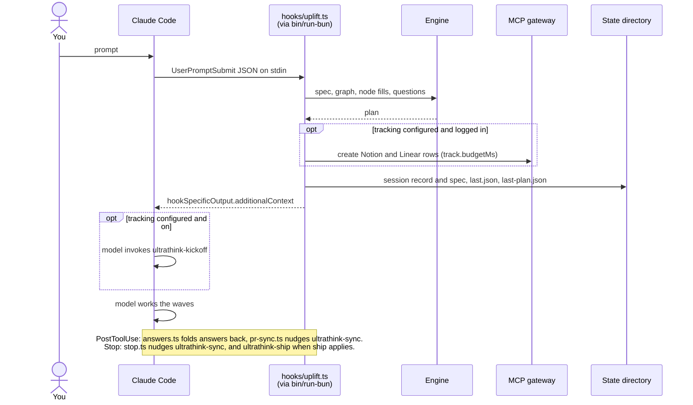
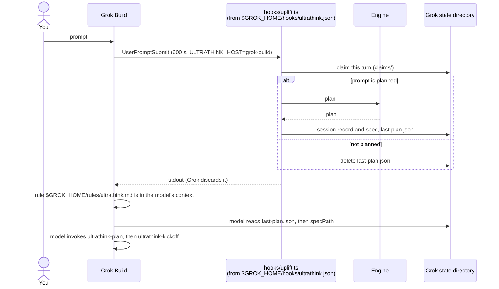
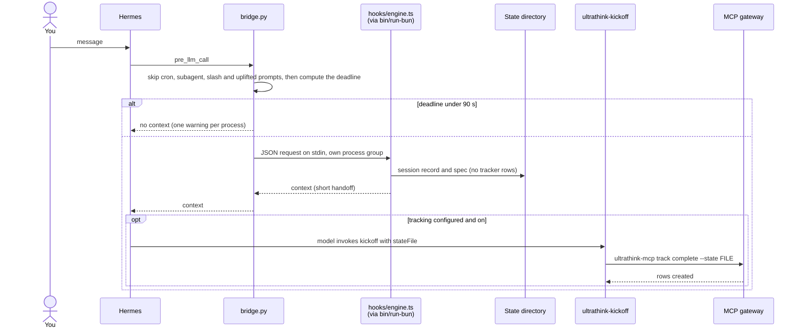
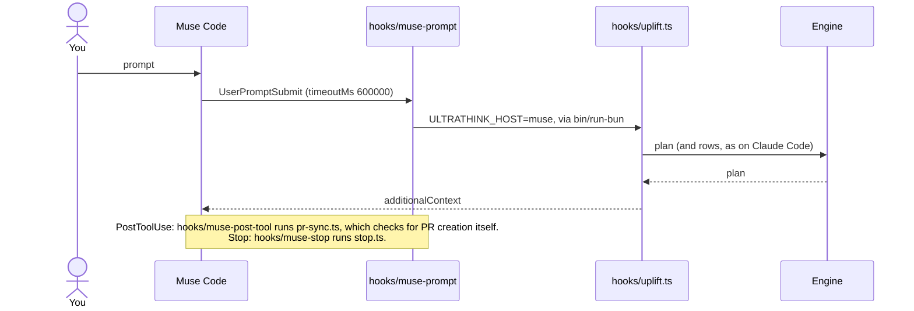
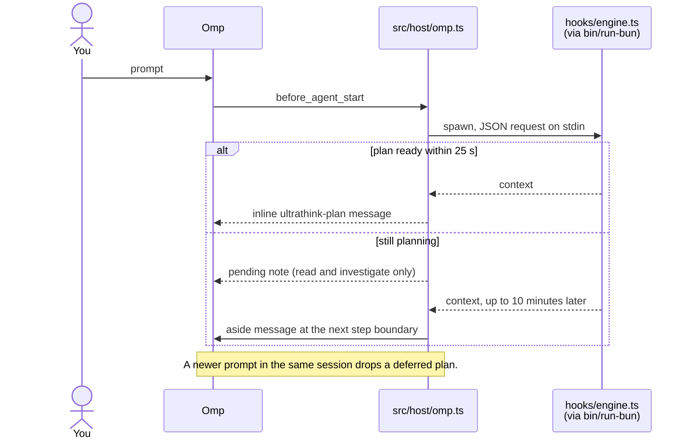
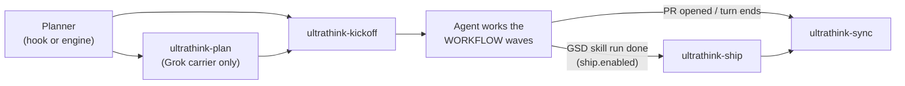
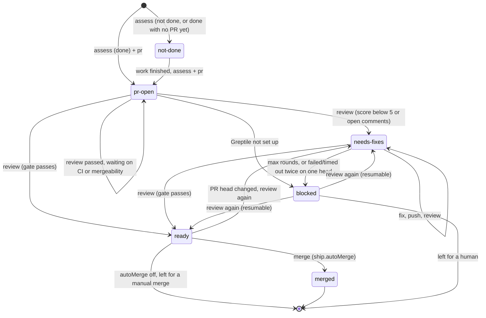

# Architecture

ultrathink is a planning layer that sits in front of your coding agent. When you send a prompt, it asks a language model to turn the prompt into a detailed specification and a small plan of connected steps, then hands that plan to your agent before the agent starts work. If you set it up, it also records the plan as rows in Notion and issues in Linear, and it can open, review and merge a pull request when a planned task is finished.

It is one TypeScript program, run with [Bun](https://bun.sh), plus a thin adapter for each agent it supports. Every stage fails open: when a stage fails, your prompt goes through with less planning. ultrathink never blocks a prompt.

This page explains how the pieces fit together. To install it, start with [Getting started](getting-started.md). To see exactly what leaves your machine, read [Privacy and data flow](privacy.md).

## Terms

| Term | Meaning |
|---|---|
| Host | The coding agent ultrathink plugs into: Claude Code, Grok Build, Hermes Agent, Muse Code or Omp. |
| Engine | The language model that writes the plan. Claude (through your `claude` CLI login) is the default. Grok (through your `grok login`) is optional. |
| Spec | The prompt rewritten as structured XML. Its `ORIGINAL` element keeps your words verbatim. |
| Graph of Thought | A plan of 5 to 8 steps (nodes) with dependencies, grouped into `WORKFLOW` waves. Nodes in one wave can run in parallel. |
| HITL | Human in the loop: up to four clarifying questions the plan asks you, each with a default answer. |
| Tracker | Notion or Linear, where the plan can be recorded as rows and issues. Both are optional. |
| MCP gateway | `bin/ultrathink-mcp`, a small local program that talks to the hosted Notion, Linear and Greptile [MCP](https://modelcontextprotocol.io) servers with credentials kept on your machine. |
| GSD | "Get Shit Done", a family of agent skills (`gsd-*`) whose runs the ship flow can pick up. |
| Greptile | A hosted AI code reviewer. The optional ship flow uses it to review a pull request before merging, and the optional knowledge-base read (`hitl.knowledgeBase`) gives the clarify step Greptile's summaries of the repository. |
| State directory | The per-host directory where ultrathink keeps its session records and toggles. It is never inside your repository. |

## Contents

- [Services and trust boundaries](#services-and-trust-boundaries)
- [Planning pipeline](#planning-pipeline)
- [How each host runs it](#how-each-host-runs-it)
- [Config and state resolution](#config-and-state-resolution)
- [Runtime constraints](#runtime-constraints)
- [Skills](#skills)
- [MCP gateway](#mcp-gateway)
- [Ship state machine](#ship-state-machine)
- [Fail-open principles](#fail-open-principles)
- [Source tree](#source-tree)

## Services and trust boundaries

Everything inside the box runs on your machine as your user. Solid arrows are used whenever the feature they belong to is on; dashed arrows are opt-in and never used by a fresh install. Tracking is on only once you configure Notion or Linear, and a fresh install configures neither. Your host's own model traffic is not shown: it happens with or without ultrathink.



The boundaries that matter:

- **Engine calls** leave through CLIs and logins you already have. ultrathink stores no Anthropic or xAI key of its own. The engine gets your prompt, text derived from it and, when you invoke a skill, the skill's name and up to 600 characters from its `SKILL.md` or command file. It never reads your source files, except in the ship flow's done check, which sends a capped diff.
- **Tracker and review calls** go only to providers that are configured and logged in. The gateway holds their tokens in one local file. The optional Greptile knowledge-base read (`hitl.knowledgeBase`) uses the same client and store, and sends only list and read calls, never the prompt or code. Separately, `bun scripts/setup.ts apply` adds `notion` and `linear` entries for the hosted MCP servers to Claude Code's user config when they are missing; Claude Code then talks to those servers itself, with its own login, and `setup.ts rollback` removes the entries it added.
- **GitHub** is reached through your `gh` login and plain `git` with your credentials for `origin`, and only by the ship flow: when you turn it on (`ship.enabled`) or run `bin/ultrathink-ship` yourself.
- **Agent Substrate** and the **Tailscale** OAuth callback are off unless you set them. The brief needs `substrate.url` or `SUBSTRATE_URL`; kickoff registers the graph only when you connect an MCP server named `substrate`. A fresh install never contacts either service.
- **Nothing else.** There is no telemetry, analytics or update check.

[Privacy and data flow](privacy.md) lists what each destination receives.

## Planning pipeline



1. **Entry.** Claude Code, Grok Build and Muse Code run `hooks/uplift.ts` as a `UserPromptSubmit` hook with Claude-shaped JSON on stdin. Hermes and Omp run `hooks/engine.ts`, which reads one JSON request (`host`, `session_id`, `prompt`, `cwd`, …) on stdin, calls `planPrompt` (`src/host/plan.ts`) and writes one JSON response (`context`, `specPath`, `statePath`, `graphId`, `skipped`, `view`, …) on stdout. Both entries end in the same `runPromptSubmit` (`src/claude/hook.ts`).
2. **Gates.** Nothing is planned for child processes that ultrathink started itself (`ULTRATHINK_CHILD=1`), when `ULTRATHINK_UPLIFT=0` is set, or for subagent envelopes. Hermes also skips cron runs and sessions with a parent session, and, in Python before Bun starts, prompts that start with `/` and already uplifted ultrathink XML. Omp skips task-subagent sessions. `/ultrathink-<verb>` commands are parsed here (`src/uplift/commands.ts`) and answered without planning (see [Commands](commands.md)).
3. **planningTarget** (`src/uplift/skill.ts`). A slash command that resolves to a `SKILL.md` or command file, or an Omp or Hermes skill scaffold, becomes a skill invocation. The planner plans the text typed alongside the skill, or the skill's own objective for a bare invocation (up to 600 characters from its frontmatter description, `<objective>` or first paragraph, which the engine also receives as context), and the injected context tells the agent that the skill stays authoritative for how the work is done. On Hermes a bare skill scaffold with no task is skipped instead. Built-in and unknown slash commands are skipped, and so are ultrathink's own skills and commands.
4. **decideUplift** (`src/uplift/detect.ts`). `raw:` passes through. `uplift:` forces planning. Already-uplifted XML, a prompt that references an existing ultrathink graph as `graph ut-<id>-<8 hex>` (as dispatched workers and the Linear issue footers do), the one-shot skip, planning turned off and trivial acknowledgements are skipped. On Hermes and Omp, `planPrompt` runs the stateless checks (prefixes, commands, uplifted XML, graph references, trivial acknowledgements) before an engine is selected, so a skipped turn never builds one.
5. **Engine** (`src/host/engine.ts`). Claude is the default. It runs headless `claude -p` with tools and setting sources disabled and reuses your existing Claude Code login (`src/claude/complete.ts`). Grok is used when the control state (`bin/ultrathink grok engine grok`) or, without one, `think.engine` says `grok`, and a `grok login` is present (not needed for the `shunt` transport, which sends to the gateway you set in `grok.shuntBaseUrl`). On the `hooks/uplift.ts` hosts (Claude Code, Grok Build, Muse) the engine is selected before step 4 runs, so when Grok is selected but not logged in, every prompt, even `ok` or a `raw:` prompt, is skipped with a `Grok 4.7 login required` message, unless `grok.fallbackToClaude` is set. The message is not shown for skill invocations, and on Hermes the prompt is skipped silently. See [Choose an engine](how-to/choose-engine.md).
6. **Substrate brief** (`src/substrate/brief.ts`, optional and off by default). Only when `substrate.url` or `SUBSTRATE_URL` is set (and `SUBSTRATE_DISABLED` is not `1`), a `POST <url>/brief` with the repository slug, branch and host name goes to your Agent Substrate server, in parallel with the uplift, with a 1.5 s timeout (`SUBSTRATE_TIMEOUT_MS`). When it answers, the brief (what other agents already did in the repository) is added to the context the agent sees; it is not sent to the engine. When it doesn't answer, or no URL is set, the step is skipped and nothing is contacted.
7. **Uplift** (`src/uplift/run.ts`). The engine rewrites the prompt into a nested XML spec whose `ORIGINAL` element keeps the user's words verbatim. When the host passes a transcript path (Claude Code, Grok Build, Muse), up to 3 500 characters of recent conversation go with it. An empty or unusable reply, or a prompt over `uplift.maxChars` (20 000), gets a conservative fallback spec (`source: "fallback"`). An over-long prompt skips only this call: the graph, node and clarification calls in steps 8 and 9 still send the full prompt unless the graph and clarifications are turned off.
8. **Graph of Thought** (`src/think/`). The engine produces `think.minNodes` to `think.maxNodes` nodes (5 to 8 by default) with dependencies. Each node is then filled with a rationale (Chain-of-Thought steps) and a conclusion, independent nodes concurrently (`claude.concurrency`) and level by level. The graph and a `WORKFLOW` of `WAVE` elements are injected into the spec. Nodes in one wave have every dependency in an earlier wave and can run in parallel.
9. **HITL** (`src/hitl/`). Up to `hitl.maxQuestions` (at most 4) clarifying questions, each with options, a default and a `blocking` flag. Questions already answered earlier in the session are kept and not asked again. With `hitl.knowledgeBase` on, the clarifier also gets the repository's Greptile knowledge base and records the questions it settles (see [Knowledge-base stage](#knowledge-base-stage)).
10. **TrackPlan** (`src/track/plan.ts`). Built only for real engine output, never for the fallback spec. It holds a graph id (`ut-…`), a Notion Task row, one Issue row and one Linear issue per node, one Sub-Issue row and one Linear sub-issue per Chain-of-Thought step, and the blocking and non-blocking questions.
11. **Gateway rows** (`src/track/gateway.ts`, `src/track/create.ts`). When tracking is on and at least one provider is configured (`notion.dataSourceUrl`, `linear.team`) and logged in, the planner creates the rows through the [MCP gateway](#mcp-gateway) before the agent sees the prompt. Node dependencies become Linear `blockedBy` relations. Creation is bounded by `track.budgetMs` (60 s) and `track.concurrency` (6), and never throws. Rows it didn't finish are left for `ultrathink-kickoff`, whose `track complete` looks up rows already recorded for the Graph ID and creates only the missing ones. The created identifiers and URLs are written into the spec's `ISSUES` block. On Hermes the hook only plans: `planPrompt` passes no tracker, and `ultrathink-kickoff` creates every row by running `ultrathink-mcp track complete --state <file>`, so a hook that Hermes abandons or kills can't leave orphan rows.
12. **Persist.** The session record goes to `<state dir>/sessions/<id>.json`, the full spec to `sessions/<id>.xml`, and a copy of the record to `last.json`.
13. **Context injection** (`src/claude/output.ts`). The context block frames the spec as the user's own request, elaborated by a plugin they installed. It adds the spec path, workflow waves and the clarifications. When tracking is configured and on, it also adds the linked issues as TODO lines and an instruction to invoke `ultrathink-kickoff`; otherwise it says that issue tracking is off for this prompt. When the ship flow is on and applies to the skill, it adds an `ultrathink-ship` instruction. On Hermes the context is a short handoff of at most 9 000 characters that points at the spec file instead of repeating it. A one-line summary goes out as `systemMessage` when `claude.echo` is on. The same text is written to the `last-plan.json` carrier in the host state directory.

`claude.budgetMs` bounds the whole run when set (0, the default, means no bound). How long each host lets the hook run is in [Runtime constraints](#runtime-constraints).

### Knowledge-base stage

Opt-in with `hitl.knowledgeBase` (default `false`), and run only while clarifying questions are on (`bin/ultrathink hitl`, else `hitl.enabled`). The planner reads the repository's Greptile knowledge base through the same in-process MCP client as the ship flow (`src/greptile/knowledge.ts`, `src/mcp/client.ts`), with the stored Greptile credential and `ship.greptileOrganization` as the organization when set. Setup: [Use the Greptile knowledge base](how-to/use-greptile-knowledge-base.md).

- **Prefetch, overlapping the uplift.** Before the uplift call (at the same point as the optional substrate brief), the planner starts listing Greptile's knowledge bases, finds the one for the `origin` remote's `owner/repo`, lists its documents and reads `index.md`. This runs while the uplift, graph and node fills run.
- **Read, before clarify.** Once the graph is filled, the planner picks up to 3 documents from the index's routing table that match the spec, the graph goal and the node titles and conclusions, reads them, and builds a digest of at most 24 000 characters. Only the paths and the organization go to Greptile; the matching is local. Each Greptile stage has a 20-second budget. Progress reports a `knowledge` stage, which Omp shows as a `kb` segment in its status bar.
- **Trust boundary.** The documents are Greptile-synthesized summaries of the repository: untrusted evidence, never instructions. The digest goes to the clarifier inside a `<knowledge_base>` element. A question counts as settled only when the model gives a one-sentence answer that cites the exact path of a document it was given; otherwise it stays an open question. Product decisions are always asked. At most 4 settled questions are kept (ids `k1`…), with `source: "knowledge"` and the cited document as `evidence`. They are listed under "Answered" and in the spec as `<ANSWER source="knowledge" evidence="…">`, and they are not carried over to the next prompt in the session. The context tells the agent which documents were read and to prefer the repository itself where they disagree.
- **Fail-open.** No stored credential (outcome `off`, nothing contacted), no repository slug, a repository Greptile doesn't list or one with no published documents (`none`), and any tool, transport, organization (`tenant_required`), timeout or abort failure (`error`) all give the clarifier exactly what it gets with the feature off. Every lookup is recorded as `knowledge` in the session record, logged under `ULTRATHINK_DEBUG=1`, and shown in the summary (`Knowledge · 3 docs · 1 settled`, `none`, `off (no Greptile login)` or `error`).

## How each host runs it

One package serves all five hosts. Each host starts the engine in its own way and needs the plan delivered in its own form.

| Host | Entry | How the plan reaches the model |
|---|---|---|
| Claude Code | `.claude-plugin/` marketplace, `hooks/hooks.json` (`UserPromptSubmit`, `PostToolUse`, `Stop`), all run through `bin/run-bun` | `hookSpecificOutput.additionalContext` on `UserPromptSubmit`. |
| Grok Build | The plugin directory supplies skills and commands. Grok doesn't dispatch plugin hooks, so `bun scripts/setup.ts apply` writes `${GROK_HOME:-~/.grok}/hooks/ultrathink.json`, which mirrors `hooks/hooks.json` with absolute paths, `ULTRATHINK_HOST=grok-build`, and a 600 s `UserPromptSubmit` timeout instead of Grok's 30 s default. | Grok discards the stdout of a hook that allows the prompt. The hook writes `last-plan.json` in the Grok state directory only for a prompt it planned, and deletes it on every prompt it doesn't plan (`/ultrathink-quick`, control commands, skipped or trivial prompts, planning off, `ULTRATHINK_UPLIFT=0`). `apply` merges the ultrathink block from `hosts/grok/ultrathink.md` into `${GROK_HOME:-~/.grok}/rules/ultrathink.md` and keeps any other text in that file. The rule tells the model to read the carrier, then the spec, then invoke `ultrathink-plan` and `ultrathink-kickoff`. A missing file means there is no plan for this prompt, and the model must not reuse an earlier one. A per-turn claim (`claims/`, keyed by session id and prompt id) stops a turn from being planned twice if Grok ever runs both the global hook and the plugin hook. |
| Muse Code | `.muse-plugin/plugin.json`: `hooks/muse-prompt`, `hooks/muse-post-tool`, `hooks/muse-stop` | Muse speaks the Claude hook protocol, so the launchers set `ULTRATHINK_HOST=muse` and run the Claude hooks. The plan arrives as `additionalContext`. Muse has no `PostToolUse` matcher, so `hooks/pr-sync.ts` filters for PR creation itself. |
| Hermes Agent | `hosts/hermes/` (`plugin.yaml`, `__init__.py`, `bridge.py`), symlinked into `${HERMES_HOME:-~/.hermes}/plugins/ultrathink` | `pre_llm_call` runs `hooks/engine.ts` in its own process group and returns `{"context": …}`, a short handoff. The deadline math is in [Runtime constraints](#hermes-hook-cap). A second `pre_llm_call` hook delivers queued PR-sync nudges. `transform_tool_result` appends the sync nudge to the tool result that opened a PR. `pre_verify` fires when a turn that edited files with `write_file` or `patch` is about to finish; once per plan (session and Graph ID), when the session record has a plan and created rows (`tracking`) but no `synced`, it returns `{"action": "continue", "message": …}` so the agent runs `ultrathink-sync` before the turn ends. |
| Omp | `package.json` `omp.extensions` → `src/host/omp.ts`, linked with `omp plugin link <clone>` | `before_agent_start` spawns `hooks/engine.ts` and waits up to 25 s. A plan ready in time is returned inline as an `ultrathink-plan` message. Otherwise a pending note is returned, telling the model to only read and investigate, and the plan arrives later as an `aside` message at the next step boundary. If you send a newer prompt in the same session before a deferred plan finishes, that plan is dropped, not delivered, and the status bar shows the newer prompt's plan. When a `/ultrathink-quick` message replaces a deferred plan, the status bar shows `superseded by a newer prompt`. Every submission is planned, including an identical resend. Only Omp's own re-runs of `before_agent_start` for the same submission (counted by `turn_start`) reuse the plan in flight. The engine run is capped at 10 minutes. In the TUI, a status bar above the editor shows the running stage, a live graph panel grows while the plan is built, and plans render as cards. `tool_result` sends an `ultrathink-sync` aside when a PR is opened, and `agent_end` sends an `ultrathink-ship` aside when the ship flow applies. |

The same flow, host by host. "Engine" below is the whole [planning pipeline](#planning-pipeline).

### Claude Code



### Grok Build



### Hermes Agent



### Muse Code



### Omp



## Config and state resolution

### Where settings come from

Every host entry, every CLI and the ship flow load the same JSON config files, lowest precedence first (`src/config.ts`, `claudeConfigPaths`):

1. `${XDG_CONFIG_HOME:-~/.config}/ultrathink/config.json`, the host-neutral user config.
2. `${CLAUDE_CONFIG_DIR:-~/.claude}/ultrathink.json`.
3. `<project>/.claude/ultrathink.json` in the working directory of the prompt.

Later files win key by key; a missing or unreadable file is skipped, and keys you don't set keep their defaults. On top of the files:

- **Control state** (`control.json` in the state directory), written by the `/ultrathink-*` commands and `bin/ultrathink`, overrides the matching config keys: planning on/off, skip-once, Graph of Thought, HITL, tracking and engine.
- **Environment variables** override both for one process: `ULTRATHINK_UPLIFT=0` (no planning), `ULTRATHINK_TRACK=0` (no planner-side rows), `ULTRATHINK_SHIP=0` (no ship flow), `SUBSTRATE_URL` / `SUBSTRATE_DISABLED=1`.

Every key and variable is in [Configuration](configuration.md). `bin/ultrathink status` (or `/ultrathink-status`) prints the effective result.

### Which host am I?

Host detection (`src/host/detect.ts`) trusts only explicit markers, because several hosts can be installed side by side:

1. `ULTRATHINK_HOST`, when it names a known host (`claude-code`, `grok-build`, `hermes`, `muse`, `omp`). The Grok hook file, the Muse launchers and the Hermes bridge set it.
2. Grok's `GROK_PLUGIN_ROOT`, `GROK_HOOK_EVENT` or `GROK_SESSION_ID`.
3. Muse's `MUSE_TOOL_USE_ID` or `MUSE_PLUGIN_ID`.
4. Otherwise Claude Code.

Hermes and Omp also pass their host id in the engine request.

### State directory

| Host | State directory |
|---|---|
| Claude Code | `${CLAUDE_CONFIG_DIR:-~/.claude}/ultrathink` |
| Grok Build | `$GROK_PLUGIN_DATA/ultrathink`, else `${GROK_HOME:-~/.grok}/plugin-data/ultrathink` |
| Hermes Agent | `${HERMES_HOME:-~/.hermes}/ultrathink` |
| Muse Code | `${XDG_CONFIG_HOME:-~/.config}/muse/ultrathink` |
| Omp | `${PI_CODING_AGENT_DIR:-~/.omp/agent}/ultrathink` |

`ULTRATHINK_STATE_DIR` overrides all of these unless it points into `.planning/`. Inside the directory:

| Path | Contents |
|---|---|
| `control.json` | Toggles set by the commands: planning, skip-once, tracking, Graph of Thought, HITL, engine. |
| `sessions/<id>.json` | The session record: spec, graph, clarifications, TrackPlan, tracking refs, skill, ship state. |
| `sessions/<id>.xml` | The full spec the agent executes. |
| `last.json` | Copy of the most recent session record (`bin/ultrathink last`, `think last`, `hitl last`). |
| `last-plan.json` | Carrier: host, session id, spec and state paths, graph id, reading instruction, context. On Grok it exists only while the latest prompt was planned. |
| `claims/` | Grok per-turn claims. |

Credentials are not in the state directory. They live in the [MCP gateway](#mcp-gateway) store.

## Runtime constraints

These are the limits of the hosts that shaped the design. If ultrathink behaves differently on one host, the reason is usually here.

### Grok Build ignores plugin hooks

Grok Build (checked with 1.0.40) discovers a plugin's `hooks/hooks.json` but never runs it. Only hook files in `${GROK_HOME:-~/.grok}/hooks/` run. `bun scripts/setup.ts apply` therefore writes `${GROK_HOME:-~/.grok}/hooks/ultrathink.json` with absolute paths into your clone, and the rule `${GROK_HOME:-~/.grok}/rules/ultrathink.md`. Because Grok also discards the stdout of a hook that lets the prompt through, the plan travels through the `last-plan.json` carrier file and the rule tells the model to read it. Move or delete the clone and the hook file points nowhere; run `apply` again from the new clone.

### Hook timeouts per host

Planning takes minutes, so every host needs a long prompt-hook timeout.

| Host | Prompt hook | Other hooks | Who sets it |
|---|---|---|---|
| Claude Code | 86 400 s | `PostToolUse` 30 s, `Stop` 60 s | `hooks/hooks.json` |
| Grok Build | 600 s (Grok's default is 30 s) | `PostToolUse` 30 s, `Stop` 60 s | The hook file `setup.ts apply` writes |
| Muse Code | 600 000 ms | `PostToolUse` 10 000 ms, `Stop` 5 000 ms | `.muse-plugin/plugin.json` |
| Hermes Agent | Hermes' `plugins.hook_callback_timeout` (30 s by default, 600 s at most) | Same cap | You, with `hermes config set` (see below) |
| Omp | Omp caps every handler at 30 s | Same cap | Omp; ultrathink waits 25 s, then delivers the plan later as an aside |

On Claude Code, 0 is not "unlimited": Claude Code would fall back to its 30 s default, which is why the manifest uses 86 400.

### Bun is found even when the host's PATH lacks it

Hosts often start hooks with a minimal `PATH`. Every hook and CLI runs through `bin/run-bun`, which tries, in order: `$BUN`, `PATH`, `$BUN_INSTALL/bin/bun`, `~/.bun/bin/bun`, `/usr/local/bin/bun`, `/opt/homebrew/bin/bun`, `~/.local/share/*/bun/bin/bun`. Bun 1.2 or later is required.

When Bun is not found, `run-bun` prints `ultrathink: bun not found. Install Bun 1.2 or later (https://bun.sh) or set BUN=/path/to/bun` to stderr. A **hook** then exits 0, so your prompt goes through unplanned. The **CLIs** (`bin/ultrathink`, `bin/ultrathink-mcp`, `bin/ultrathink-ship`) exit 127 instead, so a script can tell that they did not run.

### Hermes hook cap

Hermes abandons a plugin hook that runs longer than its `plugins.hook_callback_timeout`, a global Hermes setting that applies to every plugin. Its default is 30 s and Hermes clamps anything over 600 s to 600. ultrathink never changes it. It must be at least 105 s for prompts to be planned; 600 is recommended:

```bash
hermes config set plugins.hook_callback_timeout 600
```

The bridge (`hosts/hermes/bridge.py`) works out how long Bun may run:

- It reads the cap the way Hermes does. If this Hermes version doesn't expose that, it reads `plugins.hook_callback_timeout` from `${HERMES_HOME:-~/.hermes}/config.yaml`, else assumes 30 s, and logs one warning.
- deadline = min(540, cap − 15) seconds. `ULTRATHINK_HERMES_TIMEOUT` replaces the 540. A cap of 0 means Hermes runs the hook without a limit, so the deadline is 540.
- If the deadline is under 90 s (a cap under 105 s), Bun is never started, and one warning per process names `hermes config set plugins.hook_callback_timeout 600`.
- Bun runs in its own process group, and the whole group is killed at the deadline, so nothing outlives the hook.
- If `hooks/engine.ts` or `bin/run-bun` is not next to the plugin (a copied directory instead of a symlink into a clone), Bun is never started and one warning says so.

The context Hermes gets back is a short handoff of at most 9 000 characters, because Hermes moves a hook context over 10 000 characters to a file and keeps only its first and last 500 characters. The full spec stays in `sessions/<id>.xml`, and rows are created later by `ultrathink-kickoff`, so a hook Hermes kills leaves no half-created rows.

### One package, five hosts

The same clone serves every host. The manifests (`.claude-plugin/`, `.muse-plugin/`, `.omp-plugin/`, `package.json` `omp` and `pi` extensions, `hosts/hermes/plugin.yaml`) all point into it. Host detection, above, decides the state directory and the output format; when no marker is present, the process is treated as Claude Code. Set `ULTRATHINK_HOST` when you run a CLI by hand and want another host's state, for example `ULTRATHINK_HOST=hermes bin/ultrathink status`.

### Nothing is written to `.planning/`

GSD keeps its project files in `.planning/`. ultrathink never writes there: every state directory is outside your repository, and an `ULTRATHINK_STATE_DIR` that points into a `.planning/` directory is ignored in favour of the host default (`src/host/paths.ts`, and the same check in the Hermes bridge).

## Skills

| Skill | Invoked by | Does |
|---|---|---|
| `ultrathink-plan` | The Grok rule, or any host that dropped the hook context | Reads `last-plan.json` from the host state directory, then the spec, then hands off to `ultrathink-kickoff`. |
| `ultrathink-kickoff` | The injected context, with `stateFile=<sessions/<id>.json>` | If tracking is incomplete (on Hermes it always is, because the hook creates no rows), runs `bin/ultrathink-mcp track complete --state <stateFile>` once to create only the missing rows. Manual MCP calls are a fallback only when that command cannot run; a tracker that is down or unauthorised means no rows and a one-line note, never a block. Optionally registers the graph with an Agent Substrate server, only when an MCP server named `substrate` with a `graph_register` tool is connected; otherwise it skips that step silently. Takes the defaults for non-blocking questions and asks all blocking questions in one call to the host's question tool (`AskUserQuestion`, `ask`, `clarify`). Sets the Notion Task to `Implementing`, records the run with `ultrathink-mcp session mark --state <stateFile> kicked-off`, and returns the full spec and the linked TODO lines. The agent then runs the `WORKFLOW` waves as parallel subagents. |
| `ultrathink-sync` | PR-creation nudges (`hooks/pr-sync.ts`, Omp `tool_result`, Hermes tool hooks), the `Stop` hook, the Hermes `pre_verify` end-of-turn nudge, or by hand | Finds the Notion Task by `Graph ID` (and the Linear issues by the session record's `tracking` refs or the graph footer), never by branch, and updates the PR URL, number, branch, checks, reviewers and status on it. Moves the Linear issues to match. Never creates rows and never clears PR fields in a turn without a PR. A tracker that is down or unauthorised gets a one-line note, never a block. Ends with `bin/ultrathink-mcp session mark --state <stateFile> synced`. |
| `ultrathink-ship` | Only with `ship.enabled`: the `Stop` hook (Claude Code, Grok, Muse), the Omp `agent_end` aside, or the plan's `## Ship` section (every host, Hermes included) after a planned GSD skill run | Drives `bin/ultrathink-ship`: assess, PR, Greptile review loop, then merge only when `ship.autoMerge` is on, then `ultrathink-sync`. See [Ship](ship.md). |

They chain like this for a normal tracked prompt:



`hooks/answers.ts` (`PostToolUse` on `AskUserQuestion` in Claude Code) folds your answers back into the session record, so a later turn never asks them again. None of the hooks write to Notion or Linear. Only the planner (not on Hermes), `track complete` and the skills do.

## MCP gateway

`bin/ultrathink-mcp` (`src/mcp/`) is one gateway for Notion, Linear and Greptile, shared by every host and by the planner.

- **Relay** (`src/mcp/relay.ts`). `serve <provider>` is a stdio MCP server that forwards JSON-RPC to the hosted endpoint (`https://mcp.notion.com/mcp`, `https://mcp.linear.app/mcp`, `https://api.greptile.com/mcp`) and adds the credential. It handles upstream session expiry by re-initializing. A 401 is retried once after a token refresh, then reported as `authentication required` with the login command to run. HTTP 429, or a 401/403 whose body says rate limit, is reported as `<host> rate limited; retry after <n>s` (JSON-RPC error `-32029`) and not as an authentication failure. The planner and the ship CLI use the same relay in-process (`src/mcp/client.ts`).
- **OAuth** (`src/mcp/oauth.ts`, `src/mcp/redirect.ts`). Dynamic client registration and PKCE against each provider's protected-resource metadata. Tokens are refreshed 60 s before they expire. The browser is sent back to `http://127.0.0.1:<port>/callback` (port 8765 unless you pass `--port`). Over SSH, the login prints how to forward that port, and a pasted redirect URL is accepted too. `--redirect <url>` (or `ULTRATHINK_OAUTH_REDIRECT`) sets your own callback URL. Only with `--tailscale` (or `ULTRATHINK_OAUTH_TAILSCALE=1`) on a remote session does the login mount a temporary `tailscale serve` path for the callback and remove it afterwards; without that opt-in, `tailscale` is never run. See [Troubleshooting](troubleshooting.md).
- **One store** (`src/mcp/store.ts`). All credentials live in `${XDG_CONFIG_HOME:-~/.config}/ultrathink/mcp-credentials.json`, or at `ULTRATHINK_MCP_STORE`. The file is written atomically with mode 0600. Linear and Greptile accept an API key (`auth set-key`) or OAuth. Notion is OAuth only.
- **Lock.** Every token refresh and store write happens inside a lock directory (`<store>.lock`) and re-reads the store first, because Notion rotates its refresh token on every use and reusing a retired one can revoke the whole grant. A stale lock is taken over atomically. Requests made while the lock is held are bounded, so a hung endpoint can't outlive it.
- **Registration.** `bun scripts/mcp-register.ts [--hosts …] [--providers …] [--replace | --remove] [--dry-run]` registers `notion`, `linear` and `greptile` entries that run `<clone>/bin/ultrathink-mcp serve <provider>` in the user config of the five hosts, and backs up each file it changes (`*.bak-ultrathink-mcp-<timestamp>`). A same-named entry that is not ultrathink's is kept unless you pass `--replace`. `--remove` deletes only ultrathink's own entries. See [Register the MCP gateway](how-to/register-mcp-gateway.md).

## Ship state machine

The ship flow is opt-in: nothing is pushed, opened or merged unless `ship.enabled` is true, merging also needs `ship.autoMerge`, and deleting the branch needs `ship.deleteBranch`. The flow (`src/ship/`, `bin/ultrathink-ship`) stores its progress as `ship` in the session record. Every step is idempotent and can be resumed with `status`.



- A `review` that is still running returns `pending` and does not count as a round. It becomes a timed-out round only after `ship.reviewTimeoutMs` on the same head commit.
- When no Greptile credential is stored and the `greptile` CLI is missing or not signed in, `review` stops as `blocked` with setup instructions before any round, and posts no PR comment.
- The merge gate needs a completed review of the current PR head, a score of at least `ship.minScore` (5), no open comments (`ship.requireNoComments`), an open and mergeable PR, and CI neither failing nor pending. In PR mode, open comments are the PR's Greptile review threads on GitHub that are neither resolved nor outdated. A fix that changes the line outdates its thread, and a non-actionable finding is answered on its thread and resolved. If the thread lookup fails, the gate fails closed. In CLI mode they are the run's comments. The merge uses `gh pr merge --<method> --match-head-commit <sha>` (never `--admin`). With `ship.deleteBranch` on, it then deletes the remote branch, checks out the base, runs `git pull --ff-only`, and deletes the local branch.
- Triggers, review modes and every setting are in [Ship](ship.md).

## Fail-open principles

- **Hooks never block a prompt.** `hooks/uplift.ts`, `hooks/engine.ts`, the Muse launchers and `bin/run-bun` in hook mode exit 0 even when Bun is missing, the engine throws, or stdin is garbage. The Hermes and Omp adapters catch everything and return no context. Only the CLIs you run by hand report a missing Bun (exit 127).
- **Each stage degrades separately.** When the spec call fails, a conservative fallback spec is used and the graph and clarification stages still run. When the graph call fails or returns too few nodes, a generic 5-node fallback graph is used. A failed clarification or tracking stage drops only that stage. A failed or empty knowledge-base read leaves the clarification stage exactly as with the feature off. The substrate brief and the carrier file are optional. Progress events are display-only.
- **A fallback spec creates no rows.** A plan whose spec is the fallback is never tracked. A fallback graph under a real spec is tracked, so an engine outage that starts after the spec call can still create generic rows.
- **Tracking is bounded.** Credential resolution and row creation share `track.budgetMs`. Unfinished rows are left to `ultrathink-kickoff`, and unconfigured providers are never contacted.
- **Nudges fire once.** The ship nudge is recorded in the session before it is printed. Omp and Hermes send the PR-sync nudge once per PR URL, and the Hermes `pre_verify` sync nudge fires at most once per plan (session and Graph ID) and never after sync has recorded `synced`. A subagent's PR is credited to its parent once, through Hermes' `subagent_start` hook.
- **Nothing lands in the working tree.** State lives in the host state directory. An `ULTRATHINK_STATE_DIR` that points into `.planning/` is ignored.
- **Secrets stay out of messages.** Engine and command errors go through `redactSecrets` before they are shown, and `auth status` reports readiness without printing tokens.

## Source tree

| Path | Contents |
|---|---|
| `src/claude/` | `runPromptSubmit` orchestration (`hook.ts`), Claude engine (`complete.ts`), context and summary formatting (`output.ts`), control and session state (`state.ts`), transcript reader. |
| `src/host/` | Host ids and detection, state paths, engine selection, `planPrompt` for Hermes and Omp, the `last-plan.json` carrier, Grok turn claims, progress events, and the Omp extension with its status bar, graph panel and plan cards (`omp*.ts`). |
| `src/uplift/` | Prompt decision and prefixes (`detect.ts`), skill resolution (`skill.ts`), `/ultrathink-*` commands and `bin/ultrathink` (`commands.ts`), uplift call and fallback spec, XML helpers. |
| `src/think/` | Graph of Thought prompts, parsing, node fills, dependency levels and `WORKFLOW` waves. |
| `src/hitl/` | Clarification prompts, parsing, answer folding and formatting. |
| `src/track/` | TrackPlan (`plan.ts`), row creation (`create.ts`), gateway tracker (`gateway.ts`), `ISSUES` rendering, git repo and branch, PR detection. |
| `src/mcp/` | `bin/ultrathink-mcp` CLI, stdio relay, in-process client, OAuth, redirect planning, credential store and lock, Notion database init. |
| `src/ship/` | `bin/ultrathink-ship` CLI, done assessment, GitHub via `gh`, Greptile PR and CLI review, merge gate, ship nudge and precheck, PR title and body (`pr-body.ts`), ship state. |
| `src/grok/` | Grok engine (`http`, `cli` and `shunt` transports), `grok login` status, engine label. |
| `src/greptile/` | Optional Greptile knowledge-base reader for the clarify step: lookup, document selection from the routing table, bounded digest (`knowledge.ts`). |
| `src/substrate/` | Optional Agent Substrate brief client. |
| `src/config.ts` | Config defaults and the merge of the config files. See [Configuration](configuration.md). |
| `hooks/` | `uplift.ts` (`UserPromptSubmit`), `answers.ts`, `pr-sync.ts`, `stop.ts`, `engine.ts` (host-neutral entry), `hooks.json`, and the Muse launchers `muse-prompt`, `muse-post-tool`, `muse-stop`. |
| `hosts/` | `grok/ultrathink.md` (the Grok rule) and `hermes/` (the Hermes plugin and its bridge). |
| `skills/` | `ultrathink-plan`, `ultrathink-kickoff`, `ultrathink-sync`, `ultrathink-ship`. |
| `commands/` | The six `/ultrathink-*` command files used by Claude Code, Grok and Muse. |
| `bin/` | `run-bun` (finds Bun without `PATH`), `ultrathink`, `ultrathink-mcp`, `ultrathink-ship`. |
| `scripts/` | `setup.ts` (`apply`, `status`, `rollback`) and `mcp-register.ts`. |
| `.claude-plugin/`, `.muse-plugin/`, `.omp-plugin/` | Host manifests. |
