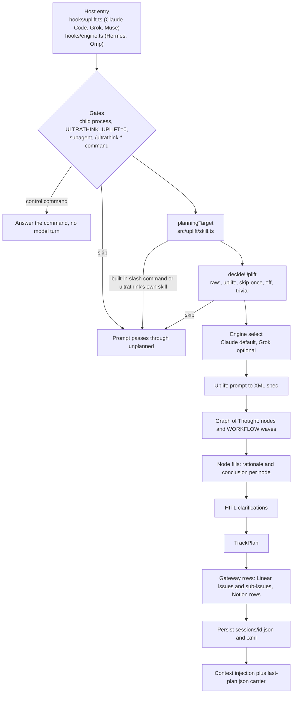
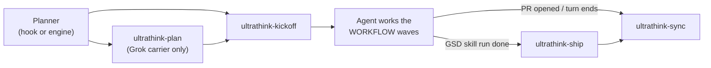
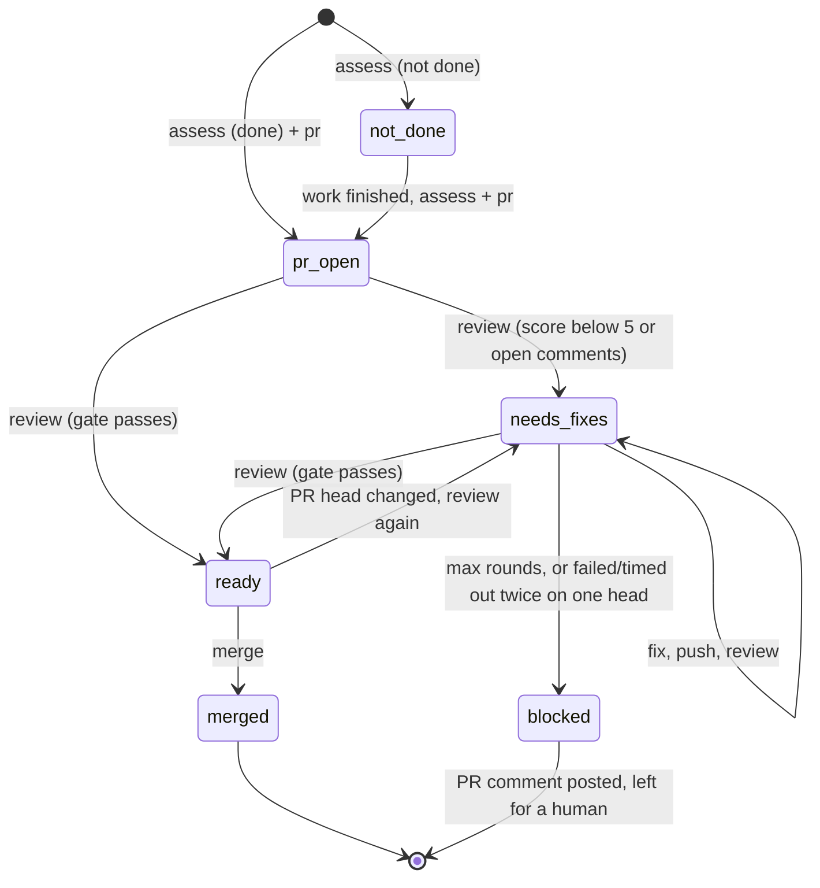

# Architecture

ultrathink is one TypeScript engine, run with Bun, plus a thin adapter per host. Each adapter gets the user's prompt to the engine and gets the plan back to the model in whatever form that host can read. Every stage fails open: when a stage fails, the prompt goes through with less planning. The prompt is never blocked.

- [Planning pipeline](#planning-pipeline)
- [Host adapters and plan carriers](#host-adapters-and-plan-carriers)
- [Skills](#skills)
- [MCP gateway](#mcp-gateway)
- [Ship state machine](#ship-state-machine)
- [Fail-open principles](#fail-open-principles)
- [State](#state)
- [Source tree](#source-tree)

## Planning pipeline

1. **Entry.** Claude Code, Grok Build and Muse Code run `hooks/uplift.ts` as a `UserPromptSubmit` hook with Claude-shaped JSON on stdin. Hermes and Omp run `hooks/engine.ts`, which reads one JSON request (`host`, `session_id`, `prompt`, `cwd`, …) on stdin, calls `planPrompt` (`src/host/plan.ts`) and writes one JSON response (`context`, `specPath`, `statePath`, `graphId`, `skipped`, `view`, …) on stdout. Both entries end in the same `runPromptSubmit` (`src/claude/hook.ts`).
2. **Gates.** Nothing is planned for child processes that ultrathink started itself (`ULTRATHINK_CHILD=1`), when `ULTRATHINK_UPLIFT=0` is set, or for subagent envelopes. Hermes also skips cron runs and sessions with a parent session, and Omp skips task-subagent sessions. `/ultrathink-<verb>` commands are parsed here (`src/uplift/commands.ts`) and answered without planning (see [Commands](commands.md)).
3. **planningTarget** (`src/uplift/skill.ts`). A slash command that resolves to a `SKILL.md` or command file, or an Omp or Hermes skill scaffold, becomes a skill invocation. The planner plans the text typed alongside the skill, or the skill's own objective for a bare invocation, and the injected context tells the agent that the skill stays authoritative for how the work is done. Built-in and unknown slash commands are skipped, and so are ultrathink's own skills and commands.
4. **decideUplift** (`src/uplift/detect.ts`). `raw:` passes through. `uplift:` forces planning. Already-uplifted XML, the one-shot skip, planning turned off and trivial acknowledgements are skipped.
5. **Engine** (`src/host/engine.ts`). Claude is the default. It runs headless `claude -p` with tools and setting sources disabled and reuses your existing Claude Code login (`src/claude/complete.ts`). Grok is used when `think.engine` or the control state says `grok` and a `grok login` is present (not needed for the `shunt` transport). When Grok is selected but not logged in, the prompt is skipped with a visible message, unless `grok.fallbackToClaude` is set.
6. **Substrate brief** (`src/substrate/brief.ts`, optional). A `POST /brief` to a local Agent Substrate service (`SUBSTRATE_URL`, default `http://127.0.0.1:7410`, 1.5 s timeout) starts in parallel with the uplift. When it answers, the graph is planned with what other agents already did in the repository. When it doesn't answer, it is skipped.
7. **Uplift** (`src/uplift/run.ts`). The engine rewrites the prompt, with recent conversation, into a nested XML spec whose `ORIGINAL` element keeps the user's words verbatim. An empty or unusable reply, or a prompt over `uplift.maxChars`, gets a conservative fallback spec (`source: "fallback"`).
8. **Graph of Thought** (`src/think/`). The engine produces `think.minNodes` to `think.maxNodes` nodes (5 to 8 by default) with dependencies. Each node is then filled with a rationale (Chain-of-Thought steps) and a conclusion, independent nodes concurrently (`claude.concurrency`) and level by level. The graph and a `WORKFLOW` of `WAVE` elements are injected into the spec. Nodes in one wave have every dependency in an earlier wave and can run in parallel.
9. **HITL** (`src/hitl/`). Up to `hitl.maxQuestions` (at most 4) clarifying questions, each with options, a default and a `blocking` flag. Questions already answered earlier in the session are kept and not asked again.
10. **TrackPlan** (`src/track/plan.ts`). Built only for real engine output, never for the fallback spec. It holds a graph id (`ut-…`), a Notion Task row, one Issue row and one Linear issue per node, one Sub-Issue row and one Linear sub-issue per Chain-of-Thought step, and the blocking and non-blocking questions.
11. **Gateway rows** (`src/track/gateway.ts`, `src/track/create.ts`). When tracking is on and at least one provider is configured and logged in, the planner creates the rows through the [MCP gateway](#mcp-gateway) before the agent sees the prompt. Node dependencies become Linear `blockedBy` relations. Creation is bounded by `track.budgetMs` (60 s) and `track.concurrency` (6), skips rows that already exist, and never throws. Rows it didn't finish are left for `ultrathink-kickoff`. The created identifiers and URLs are written into the spec's `ISSUES` block.
12. **Persist.** The session record goes to `<state dir>/sessions/<id>.json`, the full spec to `sessions/<id>.xml`, and a copy of the record to `last.json`.
13. **Context injection** (`src/claude/output.ts`). The context block frames the spec as the user's own request, elaborated by a plugin they installed. It adds the spec path, workflow waves, the linked issues as TODO lines, the clarifications, and instructions to invoke `ultrathink-kickoff` (and, for GSD skill runs, `ultrathink-ship`). A one-line summary goes out as `systemMessage` when `claude.echo` is on. The same text is written to the `last-plan.json` carrier in the host state directory.

`claude.budgetMs` bounds the whole run when set (0 means no bound). The Claude Code hook timeout in `hooks/hooks.json` is 86 400 s, so the host never cuts a plan short.

## Host adapters and plan carriers

| Host | Entry | How the plan reaches the model |
|---|---|---|
| Claude Code | `.claude-plugin/` marketplace, `hooks/hooks.json` (`UserPromptSubmit`, `PostToolUse`, `Stop`), all run through `bin/run-bun` | `hookSpecificOutput.additionalContext` on `UserPromptSubmit`. |
| Grok Build | The plugin directory supplies skills and commands. Grok doesn't dispatch plugin hooks, so `bun scripts/setup.ts apply` writes `~/.grok/hooks/ultrathink.json`, which mirrors `hooks/hooks.json` with absolute paths, `ULTRATHINK_HOST=grok-build`, and a 600 s `UserPromptSubmit` timeout instead of Grok's 30 s default. | Grok discards the stdout of a hook that allows the prompt. The hook writes `~/.grok/plugin-data/ultrathink/last-plan.json` only for a prompt it planned, and deletes it on every prompt it doesn't plan (`/ultrathink-quick`, control commands, skipped or trivial prompts, planning off, `ULTRATHINK_UPLIFT=0`). `apply` merges the ultrathink block from `hosts/grok/ultrathink.md` into `~/.grok/rules/ultrathink.md` and keeps any other text in that file. The rule tells the model to read the carrier, then the spec, then invoke `ultrathink-plan` and `ultrathink-kickoff`. A missing file means there is no plan for this prompt, and the model must not reuse an earlier one. A per-turn claim (`claims/`, keyed by session id and prompt id) stops a turn from being planned twice if Grok ever runs both the global hook and the plugin hook. |
| Muse Code | `.muse-plugin/plugin.json`: `hooks/muse-prompt`, `hooks/muse-post-tool`, `hooks/muse-stop` | Muse speaks the Claude hook protocol, so the launchers set `ULTRATHINK_HOST=muse` and run the Claude hooks. The plan arrives as `additionalContext`. Muse has no `PostToolUse` matcher, so `hooks/pr-sync.ts` filters for PR creation itself. |
| Hermes Agent | `hosts/hermes/` (`plugin.yaml`, `__init__.py`, `bridge.py`), symlinked into `~/.hermes/plugins/ultrathink` | `pre_llm_call` runs `hooks/engine.ts` in a subprocess (timeout `ULTRATHINK_HERMES_TIMEOUT`, default 540 s, under Hermes' 600 s backstop) and returns `{"context": …}`. A second `pre_llm_call` hook delivers queued PR-sync nudges. `transform_tool_result` appends the sync nudge to the tool result that opened a PR. |
| Omp | `package.json` `omp.extensions` → `src/host/omp.ts`, linked with `omp plugin link <clone>` | `before_agent_start` spawns `hooks/engine.ts` and waits up to 25 s, because Omp caps handlers at 30 s. A plan ready in time is returned inline as an `ultrathink-plan` message. Otherwise a pending note is returned, telling the model to only read and investigate, and the plan arrives later as an `aside` message at the next step boundary. If you send a newer prompt in the same session before a deferred plan finishes, that plan is dropped, not delivered, and the status bar shows `superseded by a newer prompt`. Every submission is planned, including an identical resend. Only Omp's own re-runs of `before_agent_start` for the same submission (counted by `turn_start`) reuse the plan in flight. The engine run is capped at 10 minutes. In the TUI, a status bar above the editor shows the running stage, a live graph panel grows while the plan is built, and plans render as cards. `tool_result` sends an `ultrathink-sync` aside when a PR is opened, and `agent_end` sends an `ultrathink-ship` aside. |

Host detection (`src/host/detect.ts`) trusts only explicit markers: `ULTRATHINK_HOST`, then Grok's `GROK_*` variables, then Muse's `MUSE_TOOL_USE_ID` or `MUSE_PLUGIN_ID`, and otherwise Claude Code. Hermes and Omp pass their host id in the engine request.

## Skills

| Skill | Invoked by | Does |
|---|---|---|
| `ultrathink-plan` | The Grok rule, or any host that dropped the hook context | Reads `last-plan.json` from the host state directory, then the spec, then hands off to `ultrathink-kickoff`. |
| `ultrathink-kickoff` | The injected context, with `stateFile=<sessions/<id>.json>` | If tracking is incomplete, runs `bin/ultrathink-mcp track complete --state <stateFile>` once to create only the missing rows, with manual MCP calls as a fallback. Registers the graph in the substrate index when a `substrate` MCP server is connected. Takes the defaults for non-blocking questions and asks all blocking questions in one call to the host's question tool (`AskUserQuestion`, `ask`, `clarify`). Sets the Notion Task to `Implementing` and returns the full spec and the linked TODO lines. The agent then runs the `WORKFLOW` waves as parallel subagents. |
| `ultrathink-sync` | PR-creation nudges (`hooks/pr-sync.ts`, Omp `tool_result`, Hermes tool hooks), the `Stop` hook, or by hand | Finds the Notion Task by `Graph ID` and updates the PR URL, number, branch, checks, reviewers and status on it. Moves the Linear issues to match. Never creates rows. |
| `ultrathink-ship` | The `Stop` hook (Claude Code, Grok, Muse), the Omp `agent_end` aside, or the plan's `## Ship` section (every host, Hermes included) after a planned GSD skill run | Drives `bin/ultrathink-ship`: assess, PR, Greptile review loop, merge, then `ultrathink-sync`. See [Ship](ship.md). |

They chain like this for a normal tracked prompt:

`hooks/answers.ts` (`PostToolUse` on `AskUserQuestion` in Claude Code) folds your answers back into the session record, so a later turn never asks them again. None of the hooks write to Notion or Linear. Only the planner, `track complete` and the skills do.

## MCP gateway

`bin/ultrathink-mcp` (`src/mcp/`) is one gateway for Notion, Linear and Greptile, shared by every host and by the planner.

- **Relay** (`src/mcp/relay.ts`). `serve <provider>` is a stdio MCP server that forwards JSON-RPC to the hosted endpoint (`https://mcp.notion.com/mcp`, `https://mcp.linear.app/mcp`, `https://api.greptile.com/mcp`) and adds the credential. It handles upstream session expiry by re-initializing. A 401 is retried once after a token refresh, then reported as `authentication required` with the login command to run. HTTP 429, or a 401/403 whose body says rate limit, is reported as `<host> rate limited; retry after <n>s` (JSON-RPC error `-32029`) and not as an authentication failure. The planner and the ship CLI use the same relay in-process (`src/mcp/client.ts`).
- **OAuth** (`src/mcp/oauth.ts`, `src/mcp/redirect.ts`). Dynamic client registration and PKCE against each provider's protected-resource metadata. Tokens are refreshed 60 s before they expire. Over SSH with Tailscale running, the callback goes through a temporary `tailscale serve` path. Otherwise it goes to `http://127.0.0.1:<port>/callback`, and a pasted redirect URL is accepted too. See [Troubleshooting](troubleshooting.md#notion-oauth-over-ssh).
- **One store** (`src/mcp/store.ts`). All credentials live in `~/.config/ultrathink/mcp-credentials.json` (under `XDG_CONFIG_HOME` when set, or `ULTRATHINK_MCP_STORE`). The file is written atomically with mode 0600. Linear and Greptile accept an API key. Notion is OAuth only.
- **Lock.** Every token refresh and store write happens inside a lock directory (`<store>.lock`) and re-reads the store first, because Notion rotates its refresh token on every use and reusing a retired one can revoke the whole grant. A stale lock is taken over atomically. Requests made while the lock is held are bounded, so a hung endpoint can't outlive it.
- **Registration.** `bun scripts/mcp-register.ts [--hosts …] [--providers …] [--dry-run]` registers `notion`, `linear` and `greptile` entries that run `bin/ultrathink-mcp serve <provider>` in the user config of all five hosts, and backs up each file it touches (`*.bak-ultrathink-mcp-<timestamp>`).

## Ship state machine

The ship flow (`src/ship/`, `bin/ultrathink-ship`) stores its progress as `ship` in the session record. Every step is idempotent and can be resumed with `status`.

- A `review` that is still running returns `pending` and does not count as a round. It becomes a timed-out round only after `ship.reviewTimeoutMs` on the same head commit.
- The merge gate needs a completed review of the current PR head, a score of at least `ship.minScore` (5), no open comments (`ship.requireNoComments`), an open and mergeable PR, and CI neither failing nor pending. In PR mode, open comments are the PR's Greptile review threads on GitHub that are neither resolved nor outdated. A fix that changes the line outdates its thread, and a non-actionable finding is answered on its thread and resolved. If the thread lookup fails, the gate fails closed and counts every unaddressed Greptile comment. In CLI mode they are the run's comments. The merge uses `gh pr merge --<method> --match-head-commit <sha>` (never `--admin`). With `ship.deleteBranch` on, it then deletes the remote branch, checks out the base, runs `git pull --ff-only`, and deletes the local branch.
- Triggers, review modes and every setting are in [Ship](ship.md).

## Fail-open principles

- **Every host entry exits 0.** `hooks/uplift.ts`, `hooks/engine.ts`, the Muse launchers and `bin/run-bun` exit 0 even when Bun is missing, the engine throws, or stdin is garbage. The Hermes and Omp adapters catch everything and return no context.
- **Each stage degrades separately.** A failed uplift skips planning for that prompt. A failed graph, clarification or tracking stage drops only that stage. The substrate brief and the carrier file are optional. Progress events are display-only.
- **Engine outages don't create rows.** A fallback spec is never tracked, so an outage can't fill Notion and Linear with boilerplate.
- **Tracking is bounded.** Credential resolution and row creation share `track.budgetMs`. Unfinished rows are left to `ultrathink-kickoff`, and unconfigured providers are never contacted.
- **Nudges fire once.** The ship nudge is recorded in the session before it is printed. Omp and Hermes send the PR-sync nudge once per PR URL.
- **Nothing lands in the working tree.** State lives in the host state directory. An `ULTRATHINK_STATE_DIR` that points into `.planning/` is ignored.
- **Secrets stay out of messages.** Engine and command errors go through `redactSecrets` before they are shown, and `auth status` reports readiness without printing tokens.

## State

| Host | State directory |
|---|---|
| Claude Code | `~/.claude/ultrathink` (`CLAUDE_CONFIG_DIR` aware) |
| Grok Build | `$GROK_PLUGIN_DATA/ultrathink`, else `~/.grok/plugin-data/ultrathink` |
| Hermes Agent | `$HERMES_HOME/ultrathink`, else `~/.hermes/ultrathink` |
| Muse Code | `$XDG_CONFIG_HOME/muse/ultrathink`, else `~/.config/muse/ultrathink` |
| Omp | `$PI_CODING_AGENT_DIR/ultrathink`, else `~/.omp/agent/ultrathink` |

`ULTRATHINK_STATE_DIR` overrides all of these unless it points into `.planning/`. Inside the directory:

| Path | Contents |
|---|---|
| `control.json` | Toggles set by the commands: planning, skip-once, tracking, Graph of Thought, HITL, engine. |
| `sessions/<id>.json` | The session record: spec, graph, clarifications, TrackPlan, tracking refs, skill, ship state. |
| `sessions/<id>.xml` | The full spec the agent executes. |
| `last.json` | Copy of the most recent session record (`bin/ultrathink last`, `think last`, `hitl last`). |
| `last-plan.json` | Carrier: host, session id, spec and state paths, graph id, reading instruction, context. On Grok it exists only while the latest prompt was planned. |
| `claims/` | Grok per-turn claims. |

## Source tree

| Path | Contents |
|---|---|
| `src/claude/` | `runPromptSubmit` orchestration (`hook.ts`), Claude engine (`complete.ts`), context and summary formatting (`output.ts`), control and session state (`state.ts`), transcript reader. |
| `src/host/` | Host ids and detection, state paths, engine selection, `planPrompt` for Hermes/Muse/Omp, the `last-plan.json` carrier, Grok turn claims, progress events, and the Omp extension with its status bar, graph panel and plan cards (`omp*.ts`). |
| `src/uplift/` | Prompt decision and prefixes (`detect.ts`), skill resolution (`skill.ts`), `/ultrathink-*` commands and `bin/ultrathink` (`commands.ts`), uplift call and fallback spec, XML helpers. |
| `src/think/` | Graph of Thought prompts, parsing, node fills, dependency levels and `WORKFLOW` waves. |
| `src/hitl/` | Clarification prompts, parsing, answer folding and formatting. |
| `src/track/` | TrackPlan (`plan.ts`), row creation (`create.ts`), gateway tracker (`gateway.ts`), `ISSUES` rendering, git repo and branch, PR detection. |
| `src/mcp/` | `bin/ultrathink-mcp` CLI, stdio relay, in-process client, OAuth, redirect planning, credential store and lock, Notion database init. |
| `src/ship/` | `bin/ultrathink-ship` CLI, done assessment, GitHub via `gh`, Greptile PR and CLI review, merge gate, ship nudge and precheck, ship state. |
| `src/grok/` | Grok engine (`http`, `cli` and `shunt` transports), `grok login` status, engine label. |
| `src/substrate/` | Optional Agent Substrate brief client. |
| `src/config.ts` | Config defaults and the merge of the config files. See [Configuration](configuration.md). |
| `hooks/` | `uplift.ts` (`UserPromptSubmit`), `answers.ts`, `pr-sync.ts`, `stop.ts`, `engine.ts` (host-neutral entry), `hooks.json`, and the Muse launchers `muse-prompt`, `muse-post-tool`, `muse-stop`. |
| `hosts/` | `grok/ultrathink.md` (the Grok rule) and `hermes/` (the Hermes plugin and its bridge). |
| `skills/` | `ultrathink-plan`, `ultrathink-kickoff`, `ultrathink-sync`, `ultrathink-ship`. |
| `commands/` | The six `/ultrathink-*` command files used by Claude Code, Grok and Muse. |
| `bin/` | `run-bun` (finds Bun without `PATH`), `ultrathink`, `ultrathink-mcp`, `ultrathink-ship`. |
| `scripts/` | `setup.ts` (`apply`, `status`, `rollback`) and `mcp-register.ts`. |
| `.claude-plugin/`, `.muse-plugin/`, `.omp-plugin/` | Host manifests. |
