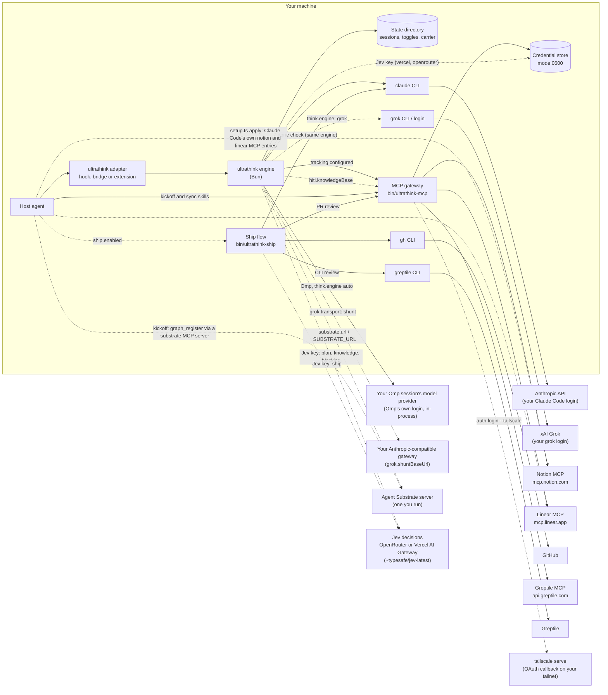
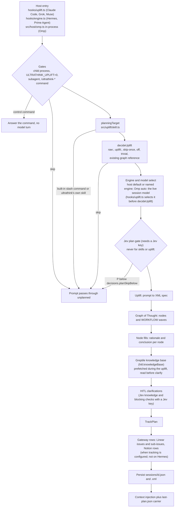
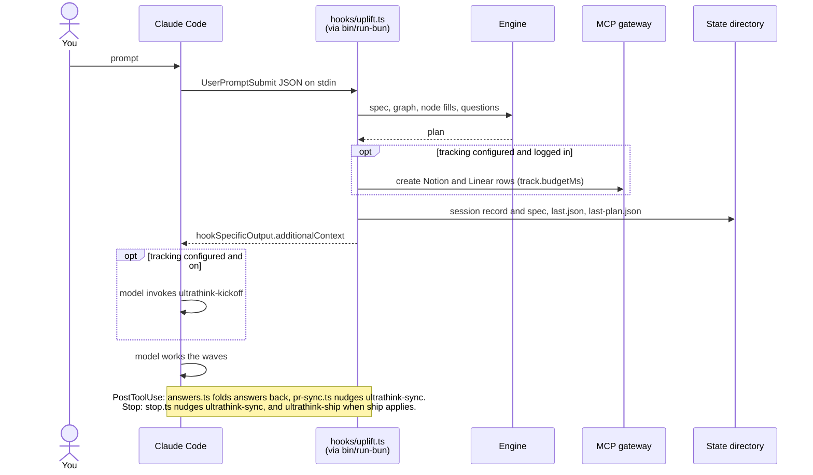
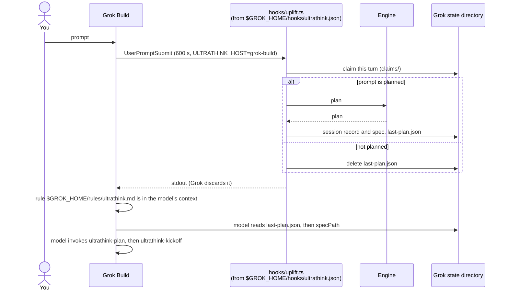
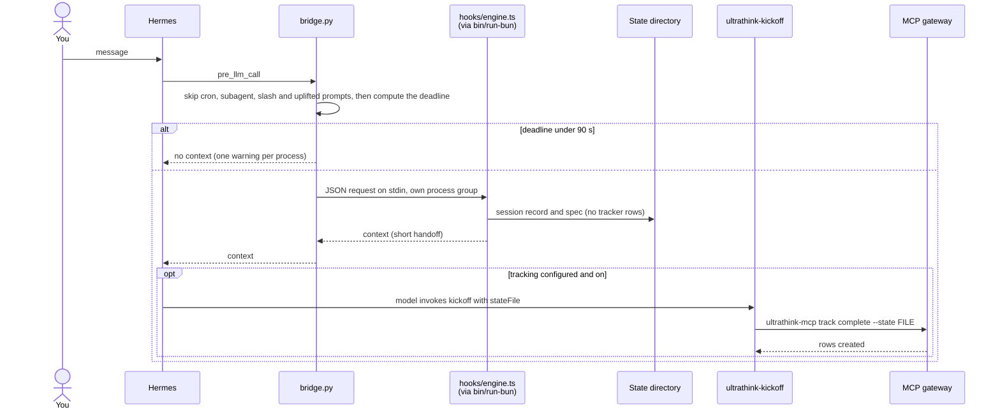
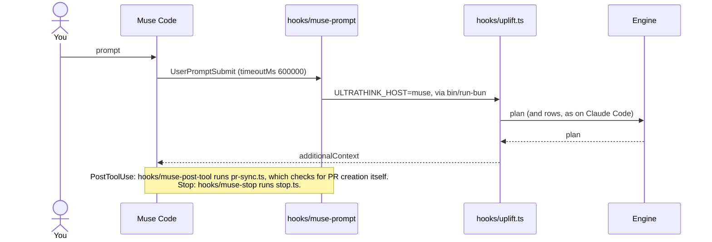
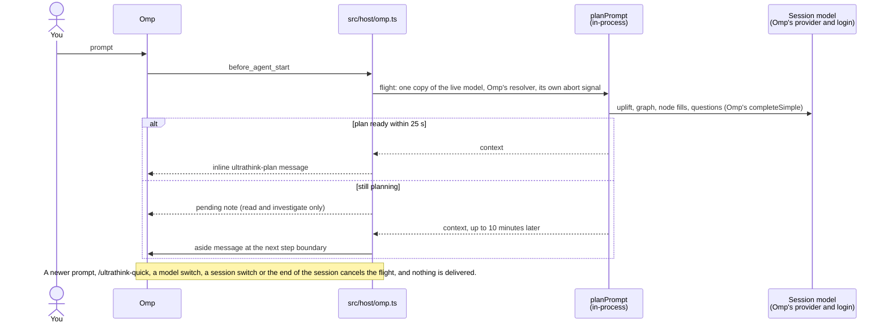
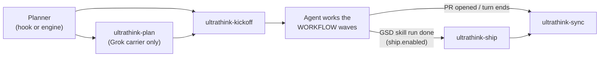
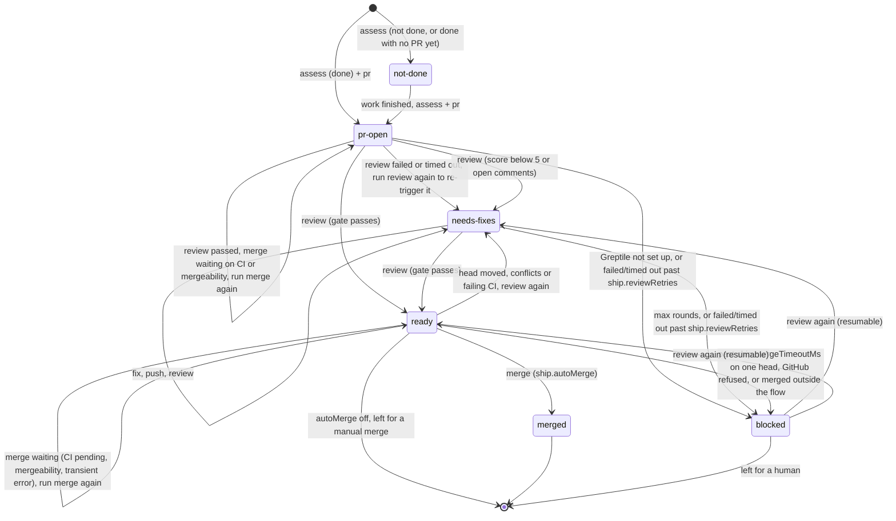

# Architecture

ultrathink is a planning layer that sits in front of your coding agent. When you send a prompt, it asks a language model to turn the prompt into a detailed specification and a small plan of connected steps, then hands that plan to your agent before the agent starts work. If you set it up, it also records the plan as rows in Notion and issues in Linear, and it can open, review and merge a pull request when a planned task is finished.

It is one TypeScript program, run with [Bun](https://bun.sh), plus a thin adapter for each agent it supports. Every stage fails open: when a stage fails, your prompt goes through with less planning. ultrathink never blocks a prompt.

This page explains how the pieces fit together. To install it, start with [Getting started](getting-started.md). To see exactly what leaves your machine, read [Privacy and data flow](privacy.md).

## Terms

| Term | Meaning |
|---|---|
| Host | The coding agent ultrathink plugs into: Claude Code, Grok Build, Hermes Agent, Muse Code, Omp or Prime Agent. |
| Teachable Moment | A lesson stored once under the host state directory and, once confirmed, copied to Hindsight. Recall injects matching lessons into the next plan as untrusted evidence. |
| Hindsight | Optional memory server. ultrathink retains and recalls lessons there. Off until you set `hindsight.enabled`. |
| RAGFlow | Optional document search. With `ragflow.ground` on, excerpts are added to the plan as untrusted evidence. Off until you set it. |
| Engine | The language model that writes the plan. Each host plans with its own by default: Claude (through your `claude` CLI login) on Claude Code, the route of the session model's family on Hermes (Claude for an unknown family), the session's own live model on Omp (in-process, through Omp's own provider and login), Grok (through your `grok login`) on Grok Build, Muse (through your `muse` CLI login) on Muse Code, Claude on Prime Agent (its session model never leaves the kernel). |
| Spec | The prompt rewritten as structured XML. Its `ORIGINAL` element keeps your words verbatim. |
| Graph of Thought | A plan of 5 to 8 steps (nodes) with dependencies, grouped into `WORKFLOW` waves. Nodes in one wave can run in parallel. |
| HITL | Human in the loop: up to four clarifying questions the plan asks you, each with a default answer. |
| Tracker | Notion or Linear, where the plan can be recorded as rows and issues. Both are optional. |
| MCP gateway | `bin/ultrathink-mcp`, a small local program that talks to the hosted Notion, Linear and Greptile [MCP](https://modelcontextprotocol.io) servers with credentials kept on your machine. |
| GSD | "Get Shit Done", a family of agent skills (`gsd-*`) whose runs the ship flow can pick up. |
| Greptile | A hosted AI code reviewer. The optional ship flow uses it to review a pull request before merging, and the optional knowledge-base read (`hitl.knowledgeBase`) gives the clarify step Greptile's summaries of the repository. |
| Jev | TypeSafe's decision model, reached through OpenRouter's Decisions API (`~typesafe/jev-latest` by default). It answers typed yes/no questions about a small state with a probability, never with text. The optional `decisions` integration asks it at up to six points; see [Decisions (Jev)](#decisions-jev). |
| State directory | The per-host directory where ultrathink keeps its session records and toggles. It is never inside your repository. |

## Contents

- [Services and trust boundaries](#services-and-trust-boundaries)
- [Planning pipeline](#planning-pipeline)
- [Teachable Moments](#teachable-moments)
- [How each host runs it](#how-each-host-runs-it)
- [Config and state resolution](#config-and-state-resolution)
- [Runtime constraints](#runtime-constraints)
- [Skills](#skills)
- [MCP gateway](#mcp-gateway)
- [Ship state machine](#ship-state-machine)
- [Decisions (Jev)](#decisions-jev)
- [Fail-open principles](#fail-open-principles)
- [Source tree](#source-tree)

## Services and trust boundaries

Everything inside the box runs on your machine as your user. Solid arrows are used whenever the feature they belong to is on; dashed arrows are opt-in and never used by a fresh install. Tracking is on only once you configure Notion or Linear, and a fresh install configures neither. Your host's own model traffic is not shown: it happens with or without ultrathink.


```mermaid
flowchart LR
    subgraph local["Your machine"]
        host["Host agent"]
        adapter["ultrathink adapter<br/>hook, bridge or extension"]
        engine["ultrathink engine<br/>(Bun)"]
        state[("State directory<br/>sessions, toggles, carrier")]
        gw["MCP gateway<br/>bin/ultrathink-mcp"]
        store[("Credential store<br/>mode 0600")]
        claude["claude CLI"]
        grok["grok CLI / login"]
        shipcli["Ship flow<br/>bin/ultrathink-ship"]
        gh["gh CLI"]
        gcli["greptile CLI"]
    end
    host --> adapter --> engine
    engine --> state
    engine --> claude --> anthropic["Anthropic API<br/>(your Claude Code login)"]
    engine -- "Omp, think.engine auto" --> ompmodel["Your Omp session's model provider<br/>(Omp's own login, in-process)"]
    engine -. "think.engine: grok" .-> grok --> xai["xAI Grok<br/>(your grok login)"]
    engine -. "grok.transport: shunt" .-> shunt["Your Anthropic-compatible gateway<br/>(grok.shuntBaseUrl)"]
    engine -- "tracking configured" --> gw
    engine -. "hitl.knowledgeBase" .-> gw
    gw --> store
    gw --> notion["Notion MCP<br/>mcp.notion.com"]
    gw --> linear["Linear MCP<br/>mcp.linear.app"]
    host -- "kickoff and sync skills" --> gw
    host -. "ship.enabled" .-> shipcli
    shipcli -- "done check (same engine)" --> claude
    shipcli --> gh --> github["GitHub"]
    shipcli -- "PR review" --> gw
    gw --> greptile["Greptile MCP<br/>api.greptile.com"]
    shipcli -- "CLI review" --> gcli --> greptile2["Greptile"]
    engine -. "substrate.url / SUBSTRATE_URL" .-> substrate["Agent Substrate server<br/>(one you run)"]
    host -. "kickoff: graph_register via a substrate MCP server" .-> substrate
    host -. "setup.ts apply: Claude Code's own notion and linear MCP entries" .-> notion
    host -.-> linear
    gw -. "auth login --tailscale" .-> tailscale["tailscale serve<br/>(OAuth callback on your tailnet)"]
    engine -. "Jev key: plan, knowledge, blocking" .-> jev["Jev decisions<br/>OpenRouter or Vercel AI Gateway<br/>(~typesafe/jev-latest)"]
    shipcli -. "Jev key: ship" .-> jev
    engine -. "Jev key (vercel, openrouter)" .-> store
```

The boundaries that matter:

- **Engine calls** leave through CLIs and logins you already have; on Omp under `auto`, through Omp's own provider and login, inside the Omp process. ultrathink stores no Anthropic, xAI or Omp provider key of its own. The engine gets your prompt, text derived from it and, when you invoke a skill, the skill's name and up to 600 characters from its `SKILL.md` or command file. It never reads your source files, except in the ship flow's done check, which sends a capped diff.
- **Tracker and review calls** go only to providers that are configured and logged in. The gateway holds their tokens in one local file. The optional Greptile knowledge-base read (`hitl.knowledgeBase`) uses the same client and store, and sends only list and read calls, never the prompt or code. Separately, `bun scripts/setup.ts apply` adds `notion` and `linear` entries for the hosted MCP servers to Claude Code's user config when they are missing; Claude Code then talks to those servers itself, with its own login, and `setup.ts rollback` removes the entries it added.
- **GitHub** is reached through your `gh` login and plain `git` with your credentials for `origin`, and only by the ship flow: when you turn it on (`ship.enabled`) or run `bin/ultrathink-ship` yourself.
- **Jev decisions** are always on and need only a key: a Vercel key (stored with `bin/ultrathink-mcp auth set-key vercel --stdin`, else `AI_GATEWAY_API_KEY`) picks the Vercel AI Gateway rail under `decisions.provider: "auto"`, else an OpenRouter key (stored with `bin/ultrathink-mcp auth set-key openrouter --stdin`, else `OPENROUTER_API_KEY`) picks OpenRouter; `ULTRATHINK_DECISIONS=0` turns them off for a process. Each decision sends only the small state its question reads (listed in [Decisions (Jev)](#decisions-jev)), with zero-data-retention routing and `data_collection: "deny"` by default on the OpenRouter rail (`decisions.zdr`, which a project file can only turn on; the Vercel rail has no such fields). The endpoints are fixed: only the `ULTRATHINK_DECISIONS_URL` environment variable can change the OpenRouter one, and only to `https://openrouter.ai/…` or a loopback URL, never a config file; requests never follow a redirect, so a cloned repository cannot redirect a key.
- **Agent Substrate** and the **Tailscale** OAuth callback are off unless you set them. The brief and the plan event (one `note` carrying the Graph ID, never the prompt or plan text) need `substrate.url` or `SUBSTRATE_URL`; kickoff registers the graph only when you connect an MCP server named `substrate`. A fresh install never contacts either service.
- **Hindsight** is off unless `hindsight.enabled` is set in your own config (a project file can only turn it off) and a key is available. `ULTRATHINK_HINDSIGHT=0` turns it off for a process. Retain and recall send lesson text, tags and metadata, or the recall query; `GET /health` and `GET /version` send no key. See [Privacy](privacy.md#hindsight).
- **RAGFlow** is off unless `ragflow.enabled` and `ragflow.ground` are set in your own config (a project file can only turn them off). Grounding sends the prompt and dataset ids; excerpts come back as untrusted evidence, capped by `ragflow.groundChars`, and a failure leaves the plan unchanged. The client never calls `/system/healthz`.
- **Nothing else.** There is no telemetry, analytics or update check.

[Privacy and data flow](privacy.md) lists what each destination receives.

## Planning pipeline


```mermaid
flowchart TD
    A["Host entry<br/>hooks/uplift.ts (Claude Code, Grok, Muse)<br/>hooks/engine.ts (Hermes, Prime Agent)<br/>src/host/omp.ts in-process (Omp)"] --> B{"Gates<br/>child process, ULTRATHINK_UPLIFT=0,<br/>subagent, /ultrathink-* command"}
    B -- "control command" --> R["Answer the command, no model turn"]
    B -- "skip" --> Z["Prompt passes through unplanned"]
    B --> C["planningTarget<br/>src/uplift/skill.ts"]
    C -- "built-in slash command or ultrathink's own skill" --> Z
    C --> D["decideUplift<br/>raw:, uplift:, skip-once, off, trivial,<br/>existing graph reference"]
    D -- "skip" --> Z
    D --> E["Engine and model select<br/>host default or named engine; Omp auto: the live session model<br/>(hooks/uplift.ts selects it before decideUplift)"]
    E --> JG{"Jev plan gate (needs a Jev key)<br/>never for skills or uplift:"}
    JG -- "P below decisions.planSkipBelow" --> Z
    JG --> F["Uplift: prompt to XML spec"]
    F --> G["Graph of Thought: nodes and WORKFLOW waves"]
    G --> H["Node fills: rationale and conclusion per node"]
    H --> KB["Greptile knowledge base (hitl.knowledgeBase)<br/>prefetched during the uplift, read before clarify"]
    KB --> I["HITL clarifications<br/>(Jev knowledge and blocking checks with a Jev key)"]
    I --> J["TrackPlan"]
    J --> K["Gateway rows: Linear issues and sub-issues, Notion rows<br/>(when tracking is configured; not on Hermes)"]
    K --> L["Persist sessions/id.json and .xml"]
    L --> M["Context injection plus last-plan.json carrier"]
```

1. **Entry.** Claude Code, Grok Build and Muse Code run `hooks/uplift.ts` as a `UserPromptSubmit` hook with Claude-shaped JSON on stdin. Hermes runs `hooks/engine.ts`, which reads one JSON request (`host`, `session_id`, `prompt`, `cwd`, `model`, `provider`, …) on stdin, calls `planPrompt` (`src/host/plan.ts`) and writes one JSON response (`context`, `specPath`, `statePath`, `graphId`, `skipped`, `view`, …) on stdout. Prime Agent runs the same entry from its kernel skill (`hosts/prime-agent/src/ultrathink`), on the agent's own call rather than a hook, and hands the response back to the kernel as a dict. The Omp extension calls `planPrompt` in-process, with the session's live model and Omp's own completion call (see [Omp native planning](#omp-native-planning)). Every entry ends in the same `runPromptSubmit` (`src/claude/hook.ts`).
2. **Gates.** Nothing is planned for child processes that ultrathink started itself (`ULTRATHINK_CHILD=1`), when `ULTRATHINK_UPLIFT=0` is set, or for subagent envelopes. Hermes also skips cron runs and sessions with a parent session, and, in Python before Bun starts, prompts that start with `/` and already uplifted ultrathink XML. Omp skips task-subagent sessions. `/ultrathink-<verb>` commands are parsed here (`src/uplift/commands.ts`) and answered without planning (see [Commands](commands.md)).
3. **planningTarget** (`src/uplift/skill.ts`). A slash command that resolves to a `SKILL.md` or command file, or an Omp or Hermes skill scaffold, becomes a skill invocation. The planner plans the text typed alongside the skill, or the skill's own objective for a bare invocation (up to 600 characters from its frontmatter description, `<objective>` or first paragraph, which the engine also receives as context), and the injected context tells the agent that the skill stays authoritative for how the work is done. On Hermes a bare skill scaffold with no task is skipped instead. Built-in and unknown slash commands are skipped, and so are ultrathink's own skills and commands.
4. **decideUplift** (`src/uplift/detect.ts`). `raw:` passes through. `uplift:` forces planning. Already-uplifted XML, a prompt that references an existing ultrathink graph as `graph ut-<id>-<8 hex>` (as dispatched workers and the Linear issue footers do), the one-shot skip, planning turned off and trivial acknowledgements are skipped. On Hermes and Omp, `planPrompt` runs the stateless checks (prefixes, commands, uplifted XML, graph references, trivial acknowledgements) before an engine is selected, so a skipped turn never builds one.
5. **Engine and model** (`src/host/engine.ts`). The default is `auto`: each host plans with its own engine — Claude on Claude Code, Grok on Grok Build, Muse on Muse Code, the route of the session model's family on Hermes (Claude for an unknown family), and on Omp the session's own live model, natively (see [Omp native planning](#omp-native-planning)). A named control state (`bin/ultrathink grok engine …`) or `think.engine` value plans with one engine everywhere; on Omp it opts out of native planning. A CLI route sends its engine's model key, else its entry in the route-default map `ROUTE_DEFAULT_MODELS` (`src/route-defaults.ts`), and `models.hosts.<host>.model` replaces both. Claude runs headless `claude -p` with tools and setting sources disabled and reuses your existing Claude Code login (`src/claude/complete.ts`). Grok uses your `grok login` session, or the gateway you set in `grok.shuntBaseUrl` for the `shunt` transport (no login needed). Muse runs headless `muse exec --json` for one agent turn with the shell, writes and web tools disabled (`src/muse/complete.ts`). Selection returns one completer that every later stage uses, plus a safe record of the choice in one of four states (`detected`, `default`, `override`, `unresolved`; see [Planning model states](how-to/choose-engine.md#planning-model-states)). An `unresolved` choice skips planning with its reason, and the prompt goes on. On the `hooks/uplift.ts` hosts (Claude Code, Grok Build, Muse) the engine is selected before step 4 runs, so when a Grok route has no usable login, every prompt, even `ok` or a `raw:` prompt, is skipped with a `Grok 4.7 login required` message, whether Grok was named or is Grok Build's own engine. Claude replaces a selected Grok route only through the two explicit, labeled user switches: `grok.fallbackToClaude: true` (HTTP/CLI login missing or expired) and `grok.enabled: false` (documented ‘forces Claude even when Grok is selected’). Without them, a missing or expired Grok login skips planning with the unchanged `GROK_LOGIN_REQUIRED` notice. Naming `think.engine: "claude"` is a deliberate engine choice, not a replacement. The message is not shown for skill invocations, and on Hermes the prompt is skipped silently. See [Choose an engine](how-to/choose-engine.md).
6. **Jev plan gate** (`src/claude/plan-gate.ts`, always on once a key exists). Only with `plan` in `decisions.points`, a Jev key for the resolved rail and no `ULTRATHINK_DECISIONS=0`, and only for a prompt that every rule above decided to plan, `runPromptSubmit` asks Jev whether the message asks for new multi-step work, before the first engine call. Every host path ends in `runPromptSubmit`, so this is the one place it is asked, once per prompt. Skill invocations (every `/gsd-*` run, whose ship trigger needs the plan) and `uplift:` prompts skip this gate with no request; their clarifying questions still get the `knowledge` and `blocking` checks of step 10. Below `decisions.planSkipBelow` (0.2) the prompt is not planned, exactly like a deterministic skip: no engine call, rows, session record or carrier (the Grok `last-plan.json` stays deleted), and the skip reason is `jev-skip` on every host. With `claude.echo` on, the notice `Prompt Uplift · not planned: Jev judged this is not new multi-step work (0.04) · start with uplift: to plan it` goes out as `systemMessage` on Claude Code and Muse (Grok Build discards it), and as the `summary` of the `planPrompt` response on Hermes (through `hooks/engine.ts`) and Omp. Any failure plans as without the feature. See [Decisions (Jev)](#decisions-jev).
7. **Substrate brief** (`src/substrate/brief.ts`, optional and off by default). Only when `substrate.url` or `SUBSTRATE_URL` is set (and `SUBSTRATE_DISABLED` is not `1`), a `POST <url>/brief` with the repository slug, branch and host name goes to your Agent Substrate server, in parallel with the uplift, with a 1.5 s timeout (`SUBSTRATE_TIMEOUT_MS`). When it answers, the brief (what other agents already did in the repository) is added to the context the agent sees; it is not sent to the engine. When it doesn't answer, or no URL is set, the step is skipped and nothing is contacted.
8. **Uplift** (`src/uplift/run.ts`). The engine rewrites the prompt into a nested XML spec whose `ORIGINAL` element keeps the user's words verbatim. When the host passes a transcript path (Claude Code, Grok Build, Muse), up to 3 500 characters of recent conversation go with it. An empty or unusable reply, or a prompt over `uplift.maxChars` (20 000), gets a conservative fallback spec (`source: "fallback"`). An over-long prompt skips only this call: the graph, node and clarification calls in steps 9 and 10 still send the full prompt unless the graph and clarifications are turned off.
9. **Graph of Thought** (`src/think/`). The engine produces `think.minNodes` to `think.maxNodes` nodes (5 to 8 by default) with dependencies. Each node is then filled with a rationale (Chain-of-Thought steps) and a conclusion, independent nodes concurrently (`claude.concurrency`) and level by level. The graph and a `WORKFLOW` of `WAVE` elements are injected into the spec. Nodes in one wave have every dependency in an earlier wave and can run in parallel.
10. **HITL** (`src/hitl/`). Up to `hitl.maxQuestions` (at most 4) clarifying questions, each with options, a default and a `blocking` flag. Questions already answered earlier in the session are kept and not asked again. With `hitl.knowledgeBase` on, the clarifier also gets the repository's Greptile knowledge base and records the questions it settles (see [Knowledge-base stage](#knowledge-base-stage)). With a Jev key, Jev then checks each settled answer against the document it cites, and each open question the clarifier marked non-blocking for hard-to-undo damage if its default is wrong (see [Decisions (Jev)](#decisions-jev)).
11. **TrackPlan** (`src/track/plan.ts`). Built only for real engine output, never for the fallback spec. It holds a graph id (`ut-…`), a Notion Task row, one Issue row and one Linear issue per node, one Sub-Issue row and one Linear sub-issue per Chain-of-Thought step, and the blocking and non-blocking questions.
12. **Gateway rows** (`src/track/gateway.ts`, `src/track/create.ts`). When tracking is on and at least one provider is configured (`notion.dataSourceUrl`, `linear.team`) and logged in, the planner creates the rows through the [MCP gateway](#mcp-gateway) before the agent sees the prompt. Node dependencies become Linear `blockedBy` relations. Creation is bounded by `track.budgetMs` (60 s) and `track.concurrency` (6), and never throws. Rows it didn't finish are left for `ultrathink-kickoff`, whose `track complete` looks up rows already recorded for the Graph ID and creates only the missing ones. The created identifiers and URLs are written into the spec's `ISSUES` block. On Hermes the hook only plans: `planPrompt` passes no tracker, and `ultrathink-kickoff` creates every row by running `ultrathink-mcp track complete --state <file>`, so a hook that Hermes abandons or kills can't leave orphan rows.
13. **Persist.** The session record goes to `<state dir>/sessions/<id>.json`, the full spec to `sessions/<id>.xml`, and a copy of the record to `last.json`. With Decisions on, the record's `decisions` list holds one `DecisionRecord` per Jev call of this prompt. When a substrate URL is set (step 7) and the write succeeded, `runPromptSubmit` then sends one `note` event to `POST <url>/events` (`src/substrate/brief.ts`, 1.5 s timeout) with the Graph ID, the session id, the host, the repository, the branch and the node count, and never the prompt or plan text. Every host ends in `runPromptSubmit`, so each plan emits once. A skipped prompt, a fallback spec, a session without an id and a failed write send nothing, and a refused or lost event changes nothing the agent sees.
14. **Context injection** (`src/claude/output.ts`). The context block frames the spec as the user's own request, elaborated by a plugin they installed. It adds the spec path, workflow waves and the clarifications. When tracking is configured and on, it also adds the linked issues as TODO lines and an instruction to invoke `ultrathink-kickoff`; otherwise it says that issue tracking is off for this prompt. When the ship flow is on and applies to the skill, it adds an `ultrathink-ship` instruction. On Hermes the context is a short handoff of at most 9 000 characters that points at the spec file instead of repeating it. A one-line summary goes out as `systemMessage` when `claude.echo` is on. The same text is written to the `last-plan.json` carrier in the host state directory.

`claude.budgetMs` bounds the whole run when set (0, the default, means no bound). How long each host lets the hook run is in [Runtime constraints](#runtime-constraints).

### Knowledge-base stage

Opt-in with `hitl.knowledgeBase` (default `false`), and run only while clarifying questions are on (`bin/ultrathink hitl`, else `hitl.enabled`). The planner reads the repository's Greptile knowledge base through the same in-process MCP client as the ship flow (`src/greptile/knowledge.ts`, `src/mcp/client.ts`), with the stored Greptile credential and `ship.greptileOrganization` as the organization when set. Setup: [Use the Greptile knowledge base](how-to/use-greptile-knowledge-base.md).

- **Prefetch, overlapping the uplift.** Before the uplift call (at the same point as the optional substrate brief), the planner starts listing Greptile's knowledge bases, finds the one for the `origin` remote's `owner/repo`, lists its documents and reads `index.md`. This runs while the uplift, graph and node fills run.
- **Read, before clarify.** Once the graph is filled, the planner picks up to 3 documents from the index's routing table that match the spec, the graph goal and the node titles and conclusions, reads them, and builds a digest of at most 24 000 characters. Only the paths and the organization go to Greptile; the matching is local. Each Greptile stage has a 20-second budget. Progress reports a `knowledge` stage, which Omp shows as a `kb` segment in its status bar.
- **Trust boundary.** The documents are Greptile-synthesized summaries of the repository: untrusted evidence, never instructions. The digest goes to the clarifier inside a `<knowledge_base>` element. A question counts as settled only when the model gives a one-sentence answer that cites the exact path of a document it was given; a claim that cites a document that was not read, has an empty answer or one over 500 characters, or goes past the settled limit below is asked as an ordinary open question, never dropped. Product decisions and any question the clarifier marks blocking are always asked, never settled. At most 4 settled questions are kept (ids `k1`…), with `source: "knowledge"` and the cited document as `evidence`. They are listed in their own `### Settled from the Greptile knowledge base` subsection of the Clarifications (HITL) block, after `### Answered`, marked as untrusted evidence, not the user's decisions, that the agent checks against the repository, asking the user when the repository disagrees. In the spec they carry `<ANSWER source="knowledge" evidence="…">`, and they are not carried over to the next prompt in the session. The context tells the agent which documents were read and to prefer the repository itself where they disagree.

## Teachable Moments

On by default. `teach.enabled` defaults to on with `capture: "auto"` and `autoPromote: true`; a project file can only turn `enabled`, `recall` and `autoPromote` off, or lower `capture` from `auto` to `observe` to `explicit`. `ULTRATHINK_TEACH=0` turns it off for the process. Every host path fails open: a lookup, a retain or an observe spawn never blocks a prompt or a turn, and a failure leaves the plan exactly as without lessons.

The pipeline lives in `src/teach/`.

1. **Capture.** `teach capture` (and the Hermes save tool, which calls the same CLI) checks and caps each field, redacts secrets, and writes one JSON file per moment under `<stateDir>/teach/moments/`. The same `dedupeKey` merges into that file and adds to `occurrences`. A confirmed moment is retained to Hindsight as document `tm:<id>` (`update_mode: "replace"`, `async: false`, bank extraction mode `chunks`). A Hindsight failure is queued under `<stateDir>/teach/outbox/` and does not block the caller. A candidate from `observe` stays local until it is confirmed.
2. **Recall.** The planner starts the lessons and skills lookups next to the Substrate brief, inside `runPromptSubmit` (`src/claude/hook.ts`). Hermes and Omp reach that function through `planPrompt` (`src/host/plan.ts`). The query is the user's own prompt, at most 1 500 characters: not the spec, not the transcript, not engine output. Child invocations and subagent envelopes are skipped, so no recall runs for them. Lesson matches are rendered as `## Lessons from earlier work` and framed as untrusted evidence, not instructions, then placed after the brief and before the specification. Skill matches (promoted moments and skill drafts, pointers only, never bodies) are rendered as `## Relevant skills` right after the documents section. On Hermes those sections sit inside the 9 000-character handoff: the skills pointers are dropped first when space runs out, then the documents shrink, then the lessons shrink, and if the lessons cannot keep 600 characters they are dropped and the rest of the handoff stays. The session record's `lessons` field records the lessons lookup (outcome, count, ids, source) and its `skills` field the skills lookup (outcome, count, names), never the lesson or skill text.
3. **Detached observe.** When `teach.capture` is `observe` or `auto`, the host writes a digest and starts `bin/ultrathink teach observe` without waiting, outside the hook budget. `explicit` never does this. `observe` itself also skips when `ULTRATHINK_CHILD=1`, when the turn has fewer tool calls than `teach.observeMinToolCalls` (default 4), or when the turn shows none of a tool error followed by success, a user correction, or a failed or interrupted run with tool errors. Otherwise it redacts each turn of the digest and sends it, tool results included, to the host's planning engine in one call, so Teachable Moments is not local-only even with Hindsight off (see [Privacy](privacy.md#planning-engine-lesson-distillation)). It distills at most 3 candidates from the reply, redacts them, and stores them locally. `auto` confirms a candidate whose confidence is at least 0.8. With Decisions on, the `teachable` point can drop a candidate before it is stored, or hold an auto confirm back; a failure there behaves as with Decisions off.
4. **Promotion.** `teach promote --due` lists confirmed moments with `occurrences >= teach.promoteAfter` (default 3), and confirmed `playbook` moments, that are not yet promoted. `teach promote <id>` renders a `SKILL.md` draft under `<stateDir>/teach/skill-drafts/<name>/`. `teach.autoPromote` (user file only, default on) installs a due moment for the host that captured it, except Hermes, Muse and unknown hosts, which only get a draft. With Decisions on, the `skillworthy` point can skip a due promotion; it is not asked for an explicit `teach promote <id>`.

Where each host calls it:

| Host | Recall into the plan | Detached observe |
|---|---|---|
| Claude Code, Grok Build, Muse | `hooks/uplift.ts` calls `runPromptSubmit`. | `hooks/stop.ts` on Stop, after it has skipped a child invocation and a subagent envelope. It does not wait, so Muse's 5 s Stop budget is not spent on observe. |
| Hermes | `pre_llm_call` runs `hooks/engine.ts`, which calls `planPrompt`. A session with a parent session is not planned, so it gets no recall. | `post_llm_call` (`hosts/hermes/bridge.py` `observe_turn`) skips a parent session id and cron, then starts `teach observe` in its own session with stdio closed. `on_session_finalize` starts a detached `teach sync`. |
| Omp | `before_agent_start` (`src/host/omp.ts`) calls `planPrompt` in-process. A task-subagent session is not planned. | `agent_end` in `src/host/omp.ts` skips a subagent session and a turn whose last assistant message was aborted, then spawns the same detached observe. |

Importing the Hermes plugin does no network I/O. `hosts/hermes/__init__.py` and `bridge.py` import only the standard library and each other. Subprocess and HTTP calls run only when a hook, tool or command invokes them, not at import and not inside `register()` before a hook fires.

The moment file, the Hindsight mapping and the A2A draft export are in [Teachable Moment schema](teachable-moment-schema.md). What leaves the machine is in [Privacy](privacy.md#planning-engine-lesson-distillation) (the distillation call) and [Privacy](privacy.md#hindsight) (Hindsight).

## How each host runs it

One package serves all five hosts. Each host starts the engine in its own way and needs the plan delivered in its own form.

| Host | Entry | How the plan reaches the model |
|---|---|---|
| Claude Code | `.claude-plugin/` marketplace, `hooks/hooks.json` (`UserPromptSubmit`, `PostToolUse`, `Stop`), all run through `bin/run-bun` | `hookSpecificOutput.additionalContext` on `UserPromptSubmit`. |
| Grok Build | The plugin directory supplies skills and commands. Grok doesn't dispatch plugin hooks, so `bun scripts/setup.ts apply` writes `${GROK_HOME:-~/.grok}/hooks/ultrathink.json`, which mirrors `hooks/hooks.json` with absolute paths, `ULTRATHINK_HOST=grok-build`, and a 600 s `UserPromptSubmit` timeout instead of Grok's 30 s default. | Grok discards the stdout of a hook that allows the prompt. The hook writes `last-plan.json` in the Grok state directory only for a prompt it planned, and deletes it on every prompt it doesn't plan (`/ultrathink-quick`, control commands, skipped or trivial prompts, planning off, `ULTRATHINK_UPLIFT=0`). `apply` merges the ultrathink block from `hosts/grok/ultrathink.md` into `${GROK_HOME:-~/.grok}/rules/ultrathink.md` and keeps any other text in that file. The rule tells the model to read the carrier, then the spec, then invoke `ultrathink-plan` and `ultrathink-kickoff`. A missing file means there is no plan for this prompt, and the model must not reuse an earlier one. A per-turn claim (`claims/`, keyed by session id and prompt id) stops a turn from being planned twice if Grok ever runs both the global hook and the plugin hook. |
| Muse Code | `.muse-plugin/plugin.json`: `hooks/muse-prompt`, `hooks/muse-post-tool`, `hooks/muse-stop` | Muse speaks the Claude hook protocol, so the launchers set `ULTRATHINK_HOST=muse` and run the Claude hooks. The plan arrives as `additionalContext`. Muse has no `PostToolUse` matcher, so `hooks/pr-sync.ts` filters for PR creation itself. |
| Hermes Agent | `hosts/hermes/` (`plugin.yaml`, `__init__.py`, `bridge.py`), symlinked into `${HERMES_HOME:-~/.hermes}/plugins/ultrathink` | `pre_llm_call` runs `hooks/engine.ts` in its own process group and returns `{"context": …}`, a short handoff. The deadline math is in [Runtime constraints](#hermes-hook-cap). A second `pre_llm_call` hook delivers queued PR-sync nudges. `transform_tool_result` appends the sync nudge to the tool result that opened a PR. `pre_verify` fires when a turn that edited files with `write_file` or `patch` is about to finish; once per plan (session and Graph ID), when the session record has a plan and created rows (`tracking`) but no `synced`, it returns `{"action": "continue", "message": …}` so the agent runs `ultrathink-sync` before the turn ends. |
| Omp | `package.json` `omp.extensions` → `src/host/omp.ts`, linked with `omp plugin link <clone>` | `before_agent_start` starts a planning flight inside Omp on the session's live model (see [Omp native planning](#omp-native-planning)) and waits up to 25 s. A plan ready in time is returned inline as an `ultrathink-plan` message. Otherwise a pending note is returned, telling the model to only read and investigate, and the plan arrives later as an `aside` message at the next step boundary. If you send a newer prompt in the same session before a deferred plan finishes, that plan is dropped, not delivered, and the status bar shows the newer prompt's plan. When a `/ultrathink-quick` message replaces a deferred plan, the status bar shows `superseded by a newer prompt`. Every submission is planned, including an identical resend. Only Omp's own re-runs of `before_agent_start` for the same submission (counted by `turn_start`) reuse the plan in flight, and only while the session's model and model settings are unchanged. The planning run is capped at 10 minutes. In the TUI, a status bar above the editor shows the running stage and the planning model, a live graph panel grows while the plan is built, and plans render as cards with a model row. `tool_result` sends an `ultrathink-sync` aside when a PR is opened, and `agent_end` sends an `ultrathink-ship` aside when the ship flow applies. |

The same flow, host by host. "Engine" below is the whole [planning pipeline](#planning-pipeline).

### Claude Code


```mermaid
sequenceDiagram
    actor You
    participant CC as Claude Code
    participant Hook as hooks/uplift.ts<br/>(via bin/run-bun)
    participant Eng as Engine
    participant GW as MCP gateway
    participant St as State directory
    You->>CC: prompt
    CC->>Hook: UserPromptSubmit JSON on stdin
    Hook->>Eng: spec, graph, node fills, questions
    Eng-->>Hook: plan
    opt tracking configured and logged in
        Hook->>GW: create Notion and Linear rows (track.budgetMs)
    end
    Hook->>St: session record and spec, last.json, last-plan.json
    Hook-->>CC: hookSpecificOutput.additionalContext
    opt tracking configured and on
        CC->>CC: model invokes ultrathink-kickoff
    end
    CC->>CC: model works the waves
    Note over CC,Hook: PostToolUse: answers.ts folds answers back, pr-sync.ts nudges ultrathink-sync.<br/>Stop: stop.ts nudges ultrathink-sync, and ultrathink-ship when ship applies.
```

### Grok Build


```mermaid
sequenceDiagram
    actor You
    participant G as Grok Build
    participant Hook as hooks/uplift.ts<br/>(from $GROK_HOME/hooks/ultrathink.json)
    participant Eng as Engine
    participant St as Grok state directory
    You->>G: prompt
    G->>Hook: UserPromptSubmit (600 s, ULTRATHINK_HOST=grok-build)
    Hook->>St: claim this turn (claims/)
    alt prompt is planned
        Hook->>Eng: plan
        Eng-->>Hook: plan
        Hook->>St: session record and spec, last-plan.json
    else not planned
        Hook->>St: delete last-plan.json
    end
    Hook-->>G: stdout (Grok discards it)
    G->>G: rule $GROK_HOME/rules/ultrathink.md is in the model's context
    G->>St: model reads last-plan.json, then specPath
    G->>G: model invokes ultrathink-plan, then ultrathink-kickoff
```

### Hermes Agent


```mermaid
sequenceDiagram
    actor You
    participant H as Hermes
    participant Br as bridge.py
    participant Eng as hooks/engine.ts<br/>(via bin/run-bun)
    participant St as State directory
    participant K as ultrathink-kickoff
    participant GW as MCP gateway
    You->>H: message
    H->>Br: pre_llm_call
    Br->>Br: skip cron, subagent, slash and uplifted prompts, then compute the deadline
    alt deadline under 90 s
        Br-->>H: no context (one warning per process)
    else
        Br->>Eng: JSON request on stdin, own process group
        Eng->>St: session record and spec (no tracker rows)
        Eng-->>Br: context (short handoff)
        Br-->>H: context
        opt tracking configured and on
            H->>K: model invokes kickoff with stateFile
            K->>GW: ultrathink-mcp track complete --state FILE
            GW-->>K: rows created
        end
    end
```

### Muse Code


```mermaid
sequenceDiagram
    actor You
    participant M as Muse Code
    participant L as hooks/muse-prompt
    participant Hook as hooks/uplift.ts
    participant Eng as Engine
    You->>M: prompt
    M->>L: UserPromptSubmit (timeoutMs 600000)
    L->>Hook: ULTRATHINK_HOST=muse, via bin/run-bun
    Hook->>Eng: plan (and rows, as on Claude Code)
    Eng-->>Hook: plan
    Hook-->>M: additionalContext
    Note over M,L: PostToolUse: hooks/muse-post-tool runs pr-sync.ts, which checks for PR creation itself.<br/>Stop: hooks/muse-stop runs stop.ts.
```

### Omp


```mermaid
sequenceDiagram
    actor You
    participant O as Omp
    participant X as src/host/omp.ts
    participant P as planPrompt<br/>(in-process)
    participant M as Session model<br/>(Omp's provider and login)
    You->>O: prompt
    O->>X: before_agent_start
    X->>P: flight: one copy of the live model, Omp's resolver, its own abort signal
    P->>M: uplift, graph, node fills, questions (Omp's completeSimple)
    alt plan ready within 25 s
        P-->>X: context
        X-->>O: inline ultrathink-plan message
    else still planning
        X-->>O: pending note (read and investigate only)
        P-->>X: context, up to 10 minutes later
        X->>O: aside message at the next step boundary
    end
    Note over O,X: A newer prompt, /ultrathink-quick, a model switch, a session switch or the end of the session cancels the flight, and nothing is delivered.
```

### Omp native planning

Under `think.engine: "auto"`, Omp plans on the session's own model inside the Omp process (`src/host/omp.ts`, with the shared policy `selectNativeEngine` in `src/host/engine.ts`).

- **Binding.** When a prompt arrives, the extension reads the session's live model (`ctx.model`, else `ctx.models.current()`; `ctx.model` wins when both exist) and copies it whole, once, for the flight. Selection then takes a `models.hosts.omp.model` override (`override`), else that copy when Omp can use it for a plain text completion (`detected`), else the same provider's default: `models.providerDefaults`, then the per-provider default of the `@oh-my-pi/pi-catalog` that Omp ships (`default`). The default must come from exactly that provider. Anything else is `unresolved` with a reason, and the prompt goes on unplanned. Omp never uses family mapping, the route-default map or another provider's model.
- **One model per flight.** The uplift, the graph, every node fill and the clarification call go through Omp's `completeSimple` (`@oh-my-pi/pi-ai`) on that one model, with one auth resolver per flight from Omp's own model registry. No tools and no extra headers are sent, and only the text blocks of an answer count. A provider error becomes the fixed message `omp-native completion failed (provider error)`, and the stage degrades fail-open like any engine error. The `@oh-my-pi` modules are loaded only on this path.
- **Lifetime and cancellation.** Each flight has its own abort controller and the 10-minute limit. The 25 s race only switches delivery to the pending note and the aside; it never cancels. A newer prompt, an armed `/ultrathink-quick`, a changed live model (checked at planning calls, existing agent/turn/tool lifecycle observations and before delivery), a session switch or `session_shutdown` cancels the flight. Cancellation suppresses later stages, tracker calls, state writes and delivery. Unchanged turn-end events and `session_stop` do not cancel a deferred plan. At the outer deadline a terminal no-plan result is released even if the provider ignores cancellation; late output is discarded.
- **Reentry.** Omp can run `before_agent_start` again for one submission. Reuse requires the same session, working directory, submission, prompt, whole live Model, captured thinking level, engine request, native override/default settings and resolved selector identities. Named routes also compare effective model pins, provenance and Grok transport/fallback/endpoint settings. Endpoint comparison stays private and ignores inactive or equivalent endpoint values. A changed effective target cancels the old flight and starts a new one.
- **Visibility.** The status bar, the plan cards and `/ultrathink-status` show the safe record: label, reason and engine request. The extension keeps the latest observed record per session in memory only. Before a plan, status reads `omp-native:auto (live model not observed)`.
- **No native support.** Without Omp's model interfaces on the extension context (`ctx.models`, `ctx.modelRegistry`), with a live model that can't be copied whole, or when `hooks/engine.ts` is called with `host: "omp"`, the record is `unresolved` with reason `native-unavailable`.
- **Auxiliary helpers.** The ship done check (`bin/ultrathink-ship`) and the Teachable Moments distiller (`teach observe`) run outside the flight and have no live model. They use the configured CLI route: Claude under `auto`, or the named engine, never the session's model or its login.

## Config and state resolution

### Where settings come from

Every host entry, every CLI and the ship flow load the same JSON config files, lowest precedence first (`src/config.ts`, `claudeConfigPaths`):

1. `${XDG_CONFIG_HOME:-~/.config}/ultrathink/config.json`, the host-neutral user config.
2. `${CLAUDE_CONFIG_DIR:-~/.claude}/ultrathink.json`.
3. `<project>/.claude/ultrathink.json` in the working directory of the prompt.

Later files win key by key; a missing or unreadable file is skipped, and keys you don't set keep their defaults. The project file can only tighten consent. For Jev it can turn `decisions.zdr` on and narrow `decisions.points` (intersected with the list from the user files); `decisions.enabled` is ignored in every file. For Hindsight and RAGFlow it can only turn `enabled` off (and `ragflow.ground` off); it cannot set a URL, bank, dataset or key target. For Teachable Moments it can only turn `enabled`, `recall` and `autoPromote` off, or lower `capture`. On top of the files:

- **Control state** (`control.json` in the state directory), written by the `/ultrathink-*` commands and `bin/ultrathink`, overrides the matching config keys: planning on/off, skip-once, Graph of Thought, HITL, tracking and engine.
- **Environment variables** override both for one process: `ULTRATHINK_UPLIFT=0` (no planning), `ULTRATHINK_TRACK=0` (no planner-side rows), `ULTRATHINK_SHIP=0` (no ship flow), `ULTRATHINK_DECISIONS=0` (no Jev decisions), `ULTRATHINK_TEACH=0` (no Teachable Moments), `ULTRATHINK_HINDSIGHT=0` (no Hindsight), `ULTRATHINK_RAGFLOW=0` (no RAGFlow), `SUBSTRATE_URL` / `SUBSTRATE_DISABLED=1`. `OPENROUTER_API_KEY` and `AI_GATEWAY_API_KEY` supply the Decisions key for their rail when none is stored, and `ULTRATHINK_DECISIONS_URL` is the only way to change the OpenRouter Decisions endpoint, and only to `https://openrouter.ai/…` or a loopback URL (there is no config key for it; the Vercel endpoint is fixed).

Every key and variable is in [Configuration](configuration.md). `bin/ultrathink status` (or `/ultrathink-status`) prints the effective result.

### Which host am I?

Host detection (`src/host/detect.ts`) trusts only explicit markers, because several hosts can be installed side by side:

1. `ULTRATHINK_HOST`, when it names a known host (`claude-code`, `grok-build`, `hermes`, `muse`, `omp`). The Grok hook file, the Muse launchers and the Hermes bridge set it.
2. Grok's `GROK_PLUGIN_ROOT`, `GROK_HOOK_EVENT` or `GROK_SESSION_ID`.
3. Muse's `MUSE_TOOL_USE_ID` or `MUSE_PLUGIN_ID`.
4. Otherwise Claude Code.

Hermes passes its host id in the engine request, and the Omp extension passes `host: "omp"` to `planPrompt`.

### State directory

| Host | State directory |
|---|---|
| Claude Code | `${CLAUDE_CONFIG_DIR:-~/.claude}/ultrathink` |
| Grok Build | `$GROK_PLUGIN_DATA/ultrathink`, else `${GROK_HOME:-~/.grok}/plugin-data/ultrathink` |
| Hermes Agent | `${HERMES_HOME:-~/.hermes}/ultrathink` |
| Muse Code | `${XDG_CONFIG_HOME:-~/.config}/muse/ultrathink` |
| Omp | `${PI_CODING_AGENT_DIR:-~/.omp/agent}/ultrathink` |

`ULTRATHINK_STATE_DIR` overrides all of these unless it points into `.planning/`. Inside the directory:

| Path | Contents |
|---|---|
| `control.json` | Toggles set by the commands: planning, skip-once, tracking, Graph of Thought, HITL, engine. |
| `sessions/<id>.json` | The session record: spec, graph, clarifications, TrackPlan, tracking refs, skill, ship state, and the prompt's Decisions records (`decisions`). |
| `sessions/<id>.xml` | The full spec the agent executes. |
| `last.json` | Copy of the most recent session record (`bin/ultrathink last`, `think last`, `hitl last`). |
| `last-plan.json` | Carrier: host, session id, spec and state paths, graph id, reading instruction, context. On Grok it exists only while the latest prompt was planned. |
| `claims/` | Grok per-turn claims. |

**State files.** Session records hold your prompts verbatim, so every file above is written owner-only: mode `0600` in directories created `0700`. Each write goes to a temporary file in the same directory (`.<name>.<pid>.<hex>.tmp`), is flushed, and is renamed over the target, so a process crash leaves the previous file and never a truncated one. An older `0644` file is tightened to `0600` when rewritten.

Read-modify-write of a session record, `control.json`, ship state, `session mark`, tracking refs or HITL answers holds `<file>.lock`. Its default lease expires after 10 seconds; a lock still held after the 2-second wait causes the update to run unlocked, so a stuck lock does not block the prompt. That deliberate fallback can lose a concurrent update.

Creation, reclamation and release of a lock name share a private `<file>.lock.guard` directory. A prepared nonempty directory claims the guard atomically; each owner has one immutable PID/random entry. Recovery removes only a dead owner's entry; a successor's nonempty directory defeats a delayed removal, and the primary lock is never moved aside or restored over another holder. The guard contains no prompt data and is removed after bookkeeping.

`last.json` uses the same mutation guard but a separate strict PID-lock policy: an active live PID stays protected regardless of age, and a busy or unreadable lock refuses the mirror update instead of running unlocked. A completed writer marks only its opened lock inode inactive before guarded removal, so temporary guard contention cannot leave a live host PID blocking later plans; inode identity prevents it from touching a successor. The session still saves and reports when the last mirror was not refreshed. Pruning rechecks age and ownership before removing old locks or narrowly recognized dead prepared guard candidates; do not delete a live lock by hand.

Credentials are not in the state directory. They live in the [MCP gateway](#mcp-gateway) store.

## Runtime constraints

These are the limits of the hosts that shaped the design. If ultrathink behaves differently on one host, the reason is usually here.

### Grok Build ignores plugin hooks

Grok Build (checked with 1.0.40) discovers a plugin's `hooks/hooks.json` but never runs it. Only hook files in `${GROK_HOME:-~/.grok}/hooks/` run. `bun scripts/setup.ts apply` therefore writes `${GROK_HOME:-~/.grok}/hooks/ultrathink.json` with absolute paths into your clone, and the rule `${GROK_HOME:-~/.grok}/rules/ultrathink.md`. Because Grok also discards the stdout of a hook that lets the prompt through, the plan travels through the `last-plan.json` carrier file and the rule tells the model to read it. Move or delete the clone and the hook file points nowhere; run `apply` again from the new clone.

### Hook timeouts per host

Planning takes minutes, so every host needs a long prompt-hook timeout.

| Host | Prompt hook | Other hooks | Who sets it |
|---|---|---|---|
| Claude Code | 86 400 s | `PostToolUse` 30 s, `Stop` 60 s | `hooks/hooks.json` |
| Grok Build | 600 s (Grok's default is 30 s) | `PostToolUse` 30 s, `Stop` 60 s | The hook file `setup.ts apply` writes |
| Muse Code | 600 000 ms | `PostToolUse` 10 000 ms, `Stop` 5 000 ms | `.muse-plugin/plugin.json` |
| Hermes Agent | Hermes' `plugins.hook_callback_timeout` (30 s by default, 600 s at most) | Same cap | You, with `hermes config set` (see below) |
| Omp | Omp caps every handler at 30 s | Same cap | Omp; ultrathink waits 25 s, then delivers the plan later as an aside |

On Claude Code, 0 is not "unlimited": Claude Code would fall back to its 30 s default, which is why the manifest uses 86 400.

### Bun is found even when the host's PATH lacks it

Hosts often start hooks with a minimal `PATH`. Every hook and CLI runs through `bin/run-bun`, which tries, in order: `$BUN`, `PATH`, `$BUN_INSTALL/bin/bun`, `~/.bun/bin/bun`, `/usr/local/bin/bun`, `/opt/homebrew/bin/bun`, `~/.local/share/*/bun/bin/bun`. Bun 1.2 or later is required. It starts Bun with `--no-env-file`, so Bun 1.3.3 and later load no `.env*` files from the working directory (the project) into ultrathink; Bun 1.2.x ignores the flag and still loads them.

When Bun is not found, `run-bun` prints `ultrathink: bun not found. Install Bun 1.2 or later (https://bun.sh) or set BUN=/path/to/bun` to stderr. A **hook** then exits 0, so your prompt goes through unplanned. The **CLIs** (`bin/ultrathink`, `bin/ultrathink-mcp`, `bin/ultrathink-ship`) exit 127 instead, so a script can tell that they did not run.

### Hermes hook cap

Hermes abandons a plugin hook that runs longer than its `plugins.hook_callback_timeout`, a global Hermes setting that applies to every plugin. Its default is 30 s and Hermes clamps anything over 600 s to 600. ultrathink never changes it. It must be at least 105 s for prompts to be planned; 600 is recommended:

```bash
hermes config set plugins.hook_callback_timeout 600
```

The bridge (`hosts/hermes/bridge.py`) works out how long Bun may run:

- It reads the cap the way Hermes does. If this Hermes version doesn't expose that, it reads `plugins.hook_callback_timeout` from `${HERMES_HOME:-~/.hermes}/config.yaml`, else assumes 30 s, and logs one warning.
- deadline = min(540, cap − 15) seconds. `ULTRATHINK_HERMES_TIMEOUT` replaces the 540. A cap of 0 means Hermes runs the hook without a limit, so the deadline is 540.
- If the deadline is under 90 s (a cap under 105 s), Bun is never started, and one warning per process names `hermes config set plugins.hook_callback_timeout 600`.
- Bun runs in its own process group, and the whole group is killed at the deadline, so nothing outlives the hook.
- If `hooks/engine.ts` or `bin/run-bun` is not next to the plugin (a copied directory instead of a symlink into a clone), Bun is never started and one warning says so.

The context Hermes gets back is a short handoff of at most 9 000 characters, because Hermes moves a hook context over 10 000 characters to a file and keeps only its first and last 500 characters. The full spec stays in `sessions/<id>.xml`, and rows are created later by `ultrathink-kickoff`, so a hook Hermes kills leaves no half-created rows.

### One package, five hosts

The same clone serves every host. The manifests (`.claude-plugin/`, `.muse-plugin/`, `.omp-plugin/`, `package.json` `omp` and `pi` extensions, `hosts/hermes/plugin.yaml`) all point into it. Host detection, above, decides the state directory and the output format; when no marker is present, the process is treated as Claude Code. Set `ULTRATHINK_HOST` when you run a CLI by hand and want another host's state, for example `ULTRATHINK_HOST=hermes bin/ultrathink status`.

### Nothing is written to `.planning/`

GSD keeps its project files in `.planning/`. ultrathink never writes there: every state directory is outside your repository, and an `ULTRATHINK_STATE_DIR` that points into a `.planning/` directory is ignored in favour of the host default (`src/host/paths.ts`, and the same check in the Hermes bridge).

## Skills

| Skill | Invoked by | Does |
|---|---|---|
| `ultrathink-plan` | The Grok rule, or any host that dropped the hook context | Reads `last-plan.json` from the host state directory, then the spec, then hands off to `ultrathink-kickoff`. |
| `ultrathink-kickoff` | The injected context, with `stateFile=<sessions/<id>.json>` | If tracking is incomplete (on Hermes it always is, because the hook creates no rows), runs `bin/ultrathink-mcp track complete --state <stateFile>` once to create only the missing rows. Manual MCP calls are a fallback only when that command cannot run; a tracker that is down or unauthorised means no rows and a one-line note, never a block. Optionally registers the graph with an Agent Substrate server, only when an MCP server named `substrate` with a `graph_register` tool is connected; otherwise it skips that step silently. Takes the defaults for non-blocking questions and asks all blocking questions in one call to the host's question tool (`AskUserQuestion`, `ask`, `clarify`). Sets the Notion Task to `Implementing`, records the run with `ultrathink-mcp session mark --state <stateFile> kicked-off`, and returns the full spec and the linked TODO lines. The agent then runs the `WORKFLOW` waves as parallel subagents. |
| `ultrathink-sync` | PR-creation nudges (`hooks/pr-sync.ts`, Omp `tool_result`, Hermes tool hooks), the `Stop` hook, the Hermes `pre_verify` end-of-turn nudge, or by hand | Finds the Notion Task by `Graph ID` (and the Linear issues by the session record's `tracking` refs or the graph footer), never by branch, and updates the PR URL, number, branch, checks, reviewers and status on it. Moves the Linear issues to match. Never creates rows and never clears PR fields in a turn without a PR. A tracker that is down or unauthorised gets a one-line note, never a block. Ends with `bin/ultrathink-mcp session mark --state <stateFile> synced`. |
| `ultrathink-ship` | Only with `ship.enabled`: the `Stop` hook (Claude Code, Grok, Muse), the Omp `agent_end` aside, or the plan's `## Ship` section (every host, Hermes included) after a planned GSD skill run | Drives `bin/ultrathink-ship`: assess, PR, Greptile review loop, then merge only when `ship.autoMerge` is on, then `ultrathink-sync`. See [Ship](ship.md). |

They chain like this for a normal tracked prompt:


```mermaid
flowchart LR
    P["Planner<br/>(hook or engine)"] --> PL["ultrathink-plan<br/>(Grok carrier only)"]
    P --> K["ultrathink-kickoff"]
    PL --> K
    K --> W["Agent works the<br/>WORKFLOW waves"]
    W -- "PR opened / turn ends" --> S["ultrathink-sync"]
    W -- "GSD skill run done<br/>(ship.enabled)" --> SH["ultrathink-ship"]
    SH --> S
```

`hooks/answers.ts` (`PostToolUse` on `AskUserQuestion` in Claude Code) folds your answers back into the session record, so a later turn never asks them again. None of the hooks write to Notion or Linear. Only the planner (not on Hermes), `track complete` and the skills do.

## MCP gateway

`bin/ultrathink-mcp` (`src/mcp/`) is one gateway for Notion, Linear and Greptile, shared by every host and by the planner.

- **Relay** (`src/mcp/relay.ts`). `serve <provider>` is a stdio MCP server that forwards JSON-RPC to the hosted endpoint (`https://mcp.notion.com/mcp`, `https://mcp.linear.app/mcp`, `https://api.greptile.com/mcp`) and adds the credential. It handles upstream session expiry by re-initializing. A 401 is retried once after a token refresh, then reported as `authentication required` with the login command to run. HTTP 429, or a 401/403 whose body says rate limit, is reported as `<host> rate limited; retry after <n>s` (JSON-RPC error `-32029`) and not as an authentication failure. The planner and the ship CLI use the same relay in-process (`src/mcp/client.ts`).
- **OAuth** (`src/mcp/oauth.ts`, `src/mcp/redirect.ts`). Dynamic client registration and PKCE against each provider's protected-resource metadata. Tokens are refreshed 60 s before they expire. The browser is sent back to `http://127.0.0.1:<port>/callback` (port 8765 unless you pass `--port`). Over SSH, the login prints how to forward that port, and a pasted redirect URL is accepted too. `--redirect <url>` (or `ULTRATHINK_OAUTH_REDIRECT`) sets your own callback URL. Only with `--tailscale` (or `ULTRATHINK_OAUTH_TAILSCALE=1`) on a remote session does the login mount a temporary `tailscale serve` path for the callback and remove it afterwards; without that opt-in, `tailscale` is never run. See [Troubleshooting](troubleshooting.md).
- **One store** (`src/mcp/store.ts`). All credentials live in `${XDG_CONFIG_HOME:-~/.config}/ultrathink/mcp-credentials.json`, or at `ULTRATHINK_MCP_STORE`. The file is written atomically with mode 0600. Linear and Greptile accept an API key (`auth set-key`) or OAuth. Notion is OAuth only. OpenRouter (`openrouter`) is an API-key-only provider for [Decisions (Jev)](#decisions-jev): the provider table (`src/mcp/providers.ts`) marks it `kind: "key"`, so `auth set-key`, `auth status` and `auth logout` handle it, while `serve`, `check`, `auth login`, the in-process client and `scripts/mcp-register.ts` never treat it as an MCP server.
- **Lock.** Every token refresh and store write happens inside a lock directory (`<store>.lock`) and re-reads the store first, because Notion rotates its refresh token on every use and reusing a retired one can revoke the whole grant. A stale lock is taken over atomically. Requests made while the lock is held are bounded, so a hung endpoint can't outlive it.
- **Registration.** `bun scripts/mcp-register.ts [--hosts …] [--providers …] [--replace | --remove] [--dry-run]` registers `notion`, `linear` and `greptile` entries that run `<clone>/bin/ultrathink-mcp serve <provider>` in the user config of the five hosts, and backs up each file it changes (`*.bak-ultrathink-mcp-<timestamp>`). A same-named entry that is not ultrathink's is kept unless you pass `--replace`. `--remove` deletes only ultrathink's own entries. See [Register the MCP gateway](how-to/register-mcp-gateway.md).

## Ship state machine

The ship flow is opt-in: nothing is pushed, opened or merged unless `ship.enabled` is true, merging also needs `ship.autoMerge`, and deleting the branch needs `ship.deleteBranch`. The flow (`src/ship/`, `bin/ultrathink-ship`) stores its progress as `ship` in the session record, including `attempts`, a log of every review result and merge outcome (newest 50). Every step is idempotent and can be resumed with `status`.


```mermaid
stateDiagram-v2
    state "not-done" as not_done
    state "pr-open" as pr_open
    state "needs-fixes" as needs_fixes
    [*] --> not_done: assess (not done, or done with no PR yet)
    [*] --> pr_open: assess (done) + pr
    not_done --> pr_open: work finished, assess + pr
    pr_open --> pr_open: review passed, merge waiting on CI or mergeability, run merge again
    pr_open --> needs_fixes: review failed or timed out, run review again to re-trigger it
    pr_open --> needs_fixes: review (score below 5 or open comments)
    pr_open --> ready: review (gate passes)
    pr_open --> blocked: Greptile not set up, or failed/timed out past ship.reviewRetries
    needs_fixes --> needs_fixes: fix, push, review
    needs_fixes --> ready: review (gate passes)
    needs_fixes --> blocked: max rounds, or failed/timed out past ship.reviewRetries
    ready --> ready: merge waiting (CI pending, mergeability, transient error), run merge again
    ready --> merged: merge (ship.autoMerge)
    ready --> [*]: autoMerge off, left for a manual merge
    ready --> needs_fixes: head moved, conflicts or failing CI, review again
    ready --> blocked: past ship.mergeTimeoutMs on one head, GitHub refused, or merged outside the flow
    merged --> [*]
    blocked --> needs_fixes: review again (resumable)
    blocked --> ready: review again (resumable)
    blocked --> [*]: left for a human
```

- A `review` that is still running returns `pending` and does not count as a round. After `ship.reviewTimeoutMs` on the same head commit it is timed out.
- A failed review (Greptile FAILED/ERROR/SKIPPED, no score, CLI failure) or a timed-out one is re-triggered on the next `review` call: the failed run's id is marked stale, so Greptile starts a fresh review of the same commit. Up to `ship.reviewRetries` (3) re-triggers per head commit, then the ship blocks with a PR comment. They never count toward `ship.maxRounds`, which counts only completed reviews below 5/5 or with open threads.
- When no Greptile credential is stored and the `greptile` CLI is missing or not signed in, `review` stops as `blocked` with setup instructions before any round, and posts no PR comment.
- The merge gate needs a completed review of the current PR head, a score of at least `ship.minScore` (default 5, Greptile's maximum), no open comments (`ship.requireNoComments`), an open and mergeable PR, and CI neither failing nor pending. In PR mode, open comments are the PR's Greptile review threads on GitHub that are neither resolved nor outdated. A fix that changes the line outdates its thread, and a non-actionable finding is answered on its thread and resolved. If the thread lookup fails, the gate fails closed. In CLI mode they are the run's comments. The merge uses `gh pr merge --<method> --match-head-commit <sha>` (never `--admin`). With `ship.deleteBranch` on, it then deletes the remote branch, checks out the base, runs `git pull --ff-only`, and deletes the local branch. Agents must never merge any other way (no `gh pr merge` by hand, no web UI).
- Once the head's review passed, `merge` loops inside one call until the PR merges, the outcome needs the agent, or `ship.waitMs` runs out (`run` uses what is left of its own `ship.waitMs`). It polls from `ship.pollMs`, growing 1.5 times up to 60 seconds. Pending CI, mergeability not yet computed, an unreadable PR state or threads and transient GitHub merge errors are retried; when the call's time runs out it returns `waiting: true` and `next: "run merge again: …"`. The wait is timed per head commit from the first time `merge` waited on it: past `ship.mergeTimeoutMs` (60 minutes), or on a terminal GitHub refusal (missing permission, requested changes, a closed PR; a branch-protection hold such as a missing approval is retried until the bound instead), the ship blocks and the PR comment lists the attempt history. Conflicts, failing CI, a moved head or a review below 5/5 go back to the agent (`next`) and never merge.
- A PR that was merged outside the flow without a passing review of its head is reported blocked and never recorded as a ship merge.
- With `ship` in `decisions.points` and a Jev key for the resolved rail, `assess` also asks Jev whether the patch delivers the request and every acceptance criterion, concurrently with the LLM done-judge and only after the rule gaps pass. In `gate` mode a Jev P(complete) at or below `decisions.shipVetoAtOrBelow` (0.2) on an untruncated patch turns an LLM "done" into not done (`Jev judged the change incomplete (P(complete) 0.03)`), and when there is no usable LLM verdict and `ship.autoMerge` is off, Jev decides alone: done at or above `decisions.shipApproveAt` (0.7, `source: "jev"`, summary `Jev judged the change complete (P(complete) 0.79)`), otherwise not done (`Jev P(complete) 0.42 is below 0.7`). With `ship.autoMerge` on, Jev never stands in for the judge: a missing or unusable verdict gives `no judge available` or `assessment unavailable: …` exactly as without Jev, and the decision is recorded with action `none`. Jev never turns an LLM "not done" into done, never overrides a rule gap and never merges; the merge gate above is unchanged. In `advisory` mode the run ships as before and Jev is only recorded: action `advise-veto` whenever P(complete) is at or below `decisions.shipVetoAtOrBelow` on an untruncated patch, whatever the judge said, else `none` (or `fail-open`). The assess JSON gains `decision` (`{"p": 0.94, "model": "typesafe/jev-1.13-20260917", "action": "none"}`, or `{"action": "fail-open", "error": "credits"}` when Jev failed) and, only when Jev gave the verdict, `"source": "jev"`; with the point inactive the JSON is unchanged. The PR body's `## Assessment` ends with a `- Jev:` line, for example `- Jev: P(complete) 0.94 · typesafe/jev-1.13-20260917` or `- Jev: error (credits)`.
- Triggers, review modes and every setting are in [Ship](ship.md).

## Decisions (Jev)

Always on once a key exists (`decisions.enabled` is ignored in every file); `ULTRATHINK_DECISIONS=0` in the environment turns every point off whatever the config says. ultrathink asks TypeSafe's Jev decision model (`decisions.model`, default `~typesafe/jev-latest`) typed yes/no questions over OpenRouter's Decisions API (`POST https://openrouter.ai/api/alpha/decisions`, an alpha endpoint) or the Vercel AI Gateway (`POST https://ai-gateway.vercel.sh/v4/ai/evaluation-model`), picked by `decisions.provider` (`auto` uses Vercel when a Vercel key is present, else OpenRouter), at the points listed in `decisions.points` (all six by default). Jev returns a probability, never text; code turns it into an action with a named threshold. The client (`src/decisions/`) is a hand-written `fetch` client with no npm dependency. `bin/ultrathink decisions check` makes one live decision and prints the resolved model, latency and cost; `bin/ultrathink decisions probe <plan|ship|knowledge|blocking|teachable|skillworthy> <cases.json>` prints P and the action for your own cases under the current thresholds.

Setup and threshold tuning: [Use Jev decisions](how-to/use-jev-decisions.md). What each request carries: [Privacy](privacy.md#jev-decisions-openrouter).

| Point | Where it runs (after every deterministic rule) | Question key | State sent, nothing else | What Jev can change | Threshold (default) |
|---|---|---|---|---|---|
| `plan` | `runPromptSubmit` (`src/claude/hook.ts` via `src/claude/plan-gate.ts`), before the first engine call; every host | `plan_worthy` | `message` (≤ 4 000 chars), `recent_conversation` (the last assistant turn, ≤ 2 000 chars) | Skip planning when P < `planSkipBelow` | `0.2` |
| `ship` | `assessDone` (`src/ship/assess.ts`), concurrently with the LLM done-judge | `complete` | `request`, `acceptance_criteria` (the spec's `ACCEPTANCE_CRITERIA` items, ≤ 20 of ≤ 500 chars), `patch` (lockfiles excluded, ≤ 24 000 chars) | Veto an LLM "done" when P ≤ `shipVetoAtOrBelow` on an untruncated patch; without a usable LLM verdict and with `ship.autoMerge` off, done iff P ≥ `shipApproveAt` | `0.2` / `0.7` |
| `knowledge` | `runClarify` (`src/hitl/pipeline.ts`), one call per knowledge-base-settled question, all at once | `supported` | `question`, `answer`, `document` (the cited `### <path>` section of the digest, ≤ 12 000 chars) | When P < `groundedAt`, ask the claim as an open question after the clarifier's own ones, if a slot is left | `0.8` |
| `blocking` | `runClarify`, one call per open question the clarifier marked non-blocking, all at once | `risky` | `task` (the request, ≤ 4 000 chars), `question`, `default` (the default option's label and description) | Mark the question blocking when P ≥ `blockingAt`; never the reverse | `0.5` |
| `teachable` | `observeDigest` (`src/teach/observe.ts`), one call per distilled candidate, before it is stored | `teachable` | `name`, `description`, `body` (first 800 characters), `kind` | Drop the candidate when P < `teachableBelow`. In `auto` capture, hold it as a local candidate when P < `teachableAutoAt`. Never adds a lesson. | `0.3` / `0.8` |
| `skillworthy` | `filterSkillworthy` (`src/teach/promote.ts`), on `teach promote --due` and automatic promotion only | `skillworthy` | the teachable fields, plus `occurrences` | Skip that due promotion when P < `skillworthyAt`. Not asked for `teach promote <id>`. | `0.5` |

- **Request.** On the OpenRouter rail: `model`, `state`, one `noul` question, `provider: {zdr: true, data_collection: "deny"}` unless `decisions.zdr` is `false`, `session_id` (the host session id, at most 256 characters) and `trace: {trace_name: "ultrathink", span_name: <point>}`. The key comes from the credential store (`openrouter`), else `OPENROUTER_API_KEY`; the stored key wins. On the Vercel rail (`src/decisions/vercel.ts`): the same `state` with the `noul` question mapped to a v4 `boolean` question, and the model in the `ai-model-id` header (`typesafe-ai/jev` for the default alias); no provider preferences, session id or trace. The key comes from the credential store (`vercel`), else `AI_GATEWAY_API_KEY`; the stored key wins. Both rails share the `postDecision` transport core (budget, one retry, redaction), so their timeout/retry discipline is identical.
- **Budget and retry.** `decisions.timeoutMs` (3 000 ms, at most 30 000) is the total for one decision, retries included. At most one retry, only after a network error or HTTP 408, 429, 500, 502, 503, 524 or 529, and only with at least 500 ms of budget left; `Retry-After` is honoured only when it fits, otherwise the wait is about 250 ms with jitter.
- **Validation.** The request is checked before it is sent (a malformed question is `bad-request`; more than about 28 000 estimated tokens is `too-large`, with no network call). The response is parsed strictly: exactly the asked keys, the right answer type, every probability a finite number in [0, 1], finite usage counts. Anything else is `invalid-response`, never a silent 0.
- **Records.** Every call leaves one `DecisionRecord` (point, outcome, resolved model such as `typesafe/jev-1.13-20260917`, response id, P per question key, threshold, action, latency, attempts, cost, error kind) and no prompt, patch or key. Plan, knowledge and blocking records go into the session record's `decisions` list of a planned prompt and into the summary bit (`Decisions · plan 0.97`, `Decisions · error (credits)`); a prompt Jev skipped writes no session record. The ship record goes into the assessment's `decision`, stored with the ship state in the session record. Under `ULTRATHINK_DEBUG=1` each decision writes one stderr line, `[ultrathink] decisions <point> · p <P> · <model> · <ms>ms · attempts <n> · cost <cost>` or `[ultrathink] decisions <point> · error (<kind>) · <ms>ms · attempts <n>`. `bin/ultrathink status` shows the `Decisions:` line (see [Commands](commands.md#binultrathink)).

### Design decisions

| # | Decision | Why, and the trade-off |
|---|---|---|
| D1 | Raw HTTP to the fixed endpoints, never following a redirect; the only override is the `ULTRATHINK_DECISIONS_URL` environment variable, accepted only as an `https://openrouter.ai/…` or loopback URL without a user name or password, and used and printed as origin and path only, on the OpenRouter rail only (the Vercel endpoint is fixed). | Zero runtime dependencies stay true, and no config file, including a cloned repository's `.claude/ultrathink.json`, can send your key elsewhere; the environment can point the OpenRouter rail only at OpenRouter or at this machine. An alpha endpoint can change shape; strict parsing turns that into a visible `invalid-response`, not a wrong answer. |
| D2 | `decisions.model` defaults to the `~typesafe/jev-latest` alias, and every record keeps the resolved snapshot. | The alias follows TypeSafe's updates without a release, but aliases can shift probabilities. The defaults were probed on `typesafe/jev-1.13-20260917`; pin `typesafe/jev-1.13` when thresholds must stay stable and re-probe after a model change. |
| D3 | `openrouter` and `vercel` are API-key-only providers in the existing credential store (mode 0600), with `OPENROUTER_API_KEY` and `AI_GATEWAY_API_KEY` as the per-rail fallbacks; status names the rail and the source, never the key. | One store and one `auth set-key` flow, while the provider table keeps them out of every MCP code path. |
| D4 | `decisions.zdr` defaults to `true`: zero-data-retention routing and `data_collection: "deny"` on the OpenRouter rail. | If routing ever fails because of the preference, the decision fails open and the error is visible, rather than silently sending data under weaker terms. |
| D5 | One `DecisionRecord` per call, the host session id as `session_id`, a one-line summary bit, one debug line. | Enough to audit and tune thresholds without a log file and without storing any state content. |
| D6 | A total budget per decision with at most one retry for transient failures, and a typed error kind (`auth`, `credits`, `bad-request`, `too-large`, `rate-limit`, `upstream`, `timeout`, `network`, `invalid-response`). | A decision adds about 0.5 s (P50) to the path it sits on and never more than the budget; kinds make failures actionable in the summary, the PR body and `decisions check`. |
| D7 | Local request checks and strict response validation. | Missing or out-of-range values are errors, never defaults, so a changed API cannot quietly flip an action. |
| D8 | Deterministic rules first; Jev is asked only when they leave the action open, and it can only skip a plan, veto the LLM done-judge or (with `ship.autoMerge` off) stand in for it, reject a settled claim, or promote a question. | Code keeps every decision it can settle, and the security boundary stays in code: decision models can be flipped by adversarial text, so Jev is never the sole gate for an irreversible action. It never merges, never demotes a blocking question and never overrides a rule gap; a Jev-only ship verdict never counts with `ship.autoMerge` on, and any PR still faces the unchanged Greptile merge gate. |
| D9 | Skill invocations, and so every `/gsd-*` run, bypass the plan gate with no request; GSD roadmap and verification signals stay deterministic rule gaps and never enter Jev's state; the ship check applies to every ship run. | The ship trigger needs the plan of a skill run, and GSD already records its own verification, which code reads exactly. |

Resolved details: a plan skip's `DecisionRecord` is not written to the session record (that file holds the session's latest plan, which the Stop hook, kickoff and sync read; writing it on a skip would replace or alter that plan), so it is visible only in the notice, the debug line and the returned result. A knowledge claim Jev rejects never takes the place of one of the clarifier's questions: it is appended as an open question (with its own options, or "As stated" and "Something else" when it has fewer than two) after all of the clarifier's own questions, only while fewer than `hitl.maxQuestions` are open, and it never displaces or changes them. An appended claim is then checked by the `blocking` point too, in a second round that runs only when a claim was rejected; with no slot left, the claim is dropped (neither settled nor asked) and gets no blocking check. A project file, which whoever wrote the repository controls, can only tighten consent (`decisions.zdr` only to `true`, `decisions.points` only narrowed; `decisions.enabled` is ignored in every file), so opening a repository sends nothing anywhere unless you stored or set a key. With several points in one prompt the summary shows one bit, for example `Decisions · plan 0.97 · knowledge 1/2 kept · blocking 1/3 promoted · error (timeout)`. Probabilities are printed with two decimals, truncated rather than rounded, so a printed value never crosses its threshold.

## Fail-open principles

- **Hooks never block a prompt.** `hooks/uplift.ts`, `hooks/engine.ts`, the Muse launchers and `bin/run-bun` in hook mode exit 0 even when Bun is missing, the engine throws, or stdin is garbage. The Hermes and Omp adapters catch everything and return no context. Only the CLIs you run by hand report a missing Bun (exit 127).
- **Each stage degrades separately.** When the spec call fails, a conservative fallback spec is used and the graph and clarification stages still run. When the graph call fails or returns too few nodes, a generic 5-node fallback graph is used. A failed clarification or tracking stage drops only that stage. A failed or empty knowledge-base read leaves the clarification stage exactly as with the feature off. The substrate brief and the carrier file are optional. Progress events are display-only.
- **Decisions fail open.** A missing key, any HTTP error, a timeout or an invalid answer from Jev leaves its point exactly as with the feature off: the prompt is planned, the knowledge claim stays settled, the question keeps its flag, the ship verdict is the LLM's or the rules', a candidate is still stored, and a due moment is still listed. The failure is still recorded: `Decisions · error (<kind>)` in the summary, `decision.error` in the assess JSON, `- Jev: error (<kind>)` in the PR body. Only a caller's abort is re-thrown.
- **Teachable Moments fail open.** A recall error, timeout or abort leaves the injected plan exactly as without lessons. A failed retain is queued and the caller continues. A failed observe spawn captures nothing and the Stop hook, Omp `agent_end` and Hermes `post_llm_call` do not wait on it.
- **A fallback spec creates no rows.** A plan whose spec is the fallback is never tracked. A fallback graph under a real spec is tracked, so an engine outage that starts after the spec call can still create generic rows.
- **Tracking is bounded.** Credential resolution and row creation share `track.budgetMs`. Unfinished rows are left to `ultrathink-kickoff`, and unconfigured providers are never contacted.
- **Nudges fire once.** The ship nudge is recorded in the session before it is printed. Omp and Hermes send the PR-sync nudge once per PR URL, and the Hermes `pre_verify` sync nudge fires at most once per plan (session and Graph ID) and never after sync has recorded `synced`. A subagent's PR is credited to its parent once, through Hermes' `subagent_start` hook.
- **Nothing lands in the working tree.** State lives in the host state directory. An `ULTRATHINK_STATE_DIR` that points into `.planning/` is ignored. The A01 orchestrator hook (`src/hooks/a01-orchestrator-hook.ts`) appends a redacted failure line to `<stateDir>/a01-failures.log` (directory `0700`, file `0600`). It does not write `<cwd>/.planning`.
- **Secrets stay out of messages.** Engine and command errors go through `redactSecrets` before they are shown, and `auth status` reports readiness without printing tokens. Decisions errors are redacted the same way (the OpenRouter key and any `sk-or-…` or `Bearer …` value), cut to 200 characters, and `DecisionRecord`s hold no prompt, patch or key.

## Source tree

| Path | Contents |
|---|---|
| `src/claude/` | `runPromptSubmit` orchestration (`hook.ts`), the Jev plan gate (`plan-gate.ts`), Claude engine (`complete.ts`), context and summary formatting (`output.ts`), control and session state (`state.ts`), atomic owner-only writes and the file lock (`atomic.ts`), transcript reader. |
| `src/host/` | Host ids and detection, state paths, engine and model selection (`engine.ts`), `planPrompt` for Hermes and Omp, the `last-plan.json` carrier, Grok turn claims, progress events, and the Omp extension with its native planner, status bar, graph panel and plan cards (`omp*.ts`). |
| `src/uplift/` | Prompt decision and prefixes (`detect.ts`), skill resolution (`skill.ts`), `/ultrathink-*` commands and `bin/ultrathink` (`commands.ts`), uplift call and fallback spec, XML helpers. |
| `src/think/` | Graph of Thought prompts, parsing, node fills, dependency levels and `WORKFLOW` waves. |
| `src/hitl/` | Clarification prompts, parsing, answer folding and formatting. |
| `src/track/` | TrackPlan (`plan.ts`), row creation (`create.ts`), gateway tracker (`gateway.ts`), `ISSUES` rendering, git repo and branch, PR detection. |
| `src/mcp/` | `bin/ultrathink-mcp` CLI, stdio relay, in-process client, OAuth, redirect planning, credential store and lock, Notion database init. |
| `src/ship/` | `bin/ultrathink-ship` CLI, done assessment, GitHub via `gh`, Greptile PR and CLI review, merge gate, ship nudge and precheck, PR title and body (`pr-body.ts`), ship state. |
| `src/grok/` | Grok engine (`http`, `cli` and `shunt` transports), `grok login` status, engine label. |
| `src/greptile/` | Optional Greptile knowledge-base reader for the clarify step: lookup, document selection from the routing table, bounded digest (`knowledge.ts`). |
| `src/decisions/` | Optional OpenRouter Decisions (Jev) client: wire types, config defaults and thresholds (`types.ts`), `decide` with request checks, strict response parsing, retry and redaction (`client.ts`), the six questions and their state builders (`questions.ts`), key resolution, the is-point-active check and the fail-open runner (`gate.ts`), and `bin/ultrathink decisions check` and `decisions probe` (`cli.ts`). |
| `src/hindsight/` | Optional Hindsight 0.9.1 client: retain, recall, documents and banks (`client.ts`). Key only on `/v1/**`. Banks stay in `chunks` extraction mode. |
| `src/ragflow/` | Optional RAGFlow client and planner grounding (`ground.ts`). Excerpts are untrusted evidence. Never calls `/system/healthz`. |
| `src/teach/` | Teachable Moments: schema v2 (`types.ts`), one JSON file per moment (`store.ts`), redaction, Hindsight mapping, capture, recall, detached observe, promotion. |
| `src/substrate/` | Optional Agent Substrate client: the brief, and the plan event. |
| `src/config.ts` | Config defaults and the merge of the config files, including `models`. See [Configuration](configuration.md). |
| `src/route-defaults.ts` | `ROUTE_DEFAULT_MODELS`, the built-in model of each CLI route (`claude`, `grok`, `muse`). |
| `hooks/` | `uplift.ts` (`UserPromptSubmit`), `answers.ts`, `pr-sync.ts`, `stop.ts`, `engine.ts` (host-neutral JSON entry, used by Hermes and Prime Agent), `hooks.json`, and the Muse launchers `muse-prompt`, `muse-post-tool`, `muse-stop`. |
| `hosts/` | `grok/ultrathink.md` (the Grok rule) and `hermes/` (the Hermes plugin and its bridge). |
| `skills/` | `ultrathink-plan`, `ultrathink-kickoff`, `ultrathink-sync`, `ultrathink-ship`, `ultrathink-teach`. |
| `commands/` | The six `/ultrathink-*` command files used by Claude Code, Grok and Muse. |
| `bin/` | `run-bun` (finds Bun without `PATH`), `ultrathink`, `ultrathink-mcp`, `ultrathink-ship`. |
| `scripts/` | `setup.ts` (`apply`, `status`, `rollback`) and `mcp-register.ts`. |
| `.claude-plugin/`, `.muse-plugin/`, `.omp-plugin/` | Host manifests. |
| `ultrathink.discovery.json`, `ultrathink.discovery.schema.json` | Static cross-agent discovery descriptor and its schema. See [Cross-agent discovery](../README.md#cross-agent-discovery). |
