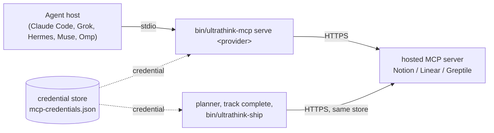

# Register the MCP gateway in your hosts

This guide gives the agents in your hosts (Claude Code, Grok Build, Hermes Agent, Muse Code, Omp) the Notion, Linear and Greptile tools, using the login you already stored for ultrathink.

## What the gateway is

MCP (Model Context Protocol) is how an agent host calls outside tools. Notion, Linear and Greptile each run a hosted MCP server:

| Provider | Hosted server |
|---|---|
| `notion` | `https://mcp.notion.com/mcp` |
| `linear` | `https://mcp.linear.app/mcp` |
| `greptile` | `https://api.greptile.com/mcp` |

The **MCP gateway** is `<clone>/bin/ultrathink-mcp serve <provider>`, where `<clone>` is the directory you cloned ultrathink into. It is a local stdio MCP server: the host starts it, sends it MCP messages, and the gateway relays each one to that vendor's hosted server, adding the credential from ultrathink's credential store (`~/.config/ultrathink/mcp-credentials.json`). It refreshes OAuth tokens as needed, and reports a rate limit as a rate limit instead of a login problem. ultrathink runs no server of its own; nothing goes anywhere except the vendor's server.



The planner, `bin/ultrathink-mcp track complete` and `bin/ultrathink-ship` read the credential store directly and need no registration. Registering the gateway matters for the agent's own tool calls: the `ultrathink-sync` skill updating rows after a PR, the `ultrathink-kickoff` skill creating rows by hand when `track complete` cannot run, and anything you ask the agent to do in Notion, Linear or Greptile.

## When you do not need it

- **You do not use tracking or ship.** With no tracker configured and ship off, nothing uses these tools.
- **Your host already has the official Notion and Linear servers connected**, and you are happy to log in to them separately. The skills call Notion and Linear tools by the names the vendors' hosted servers give them (`notion-fetch`, `save_issue` and so on), so they work through either connection. For example, `bun scripts/setup.ts apply` adds the hosted Notion and Linear servers to Claude Code as HTTP servers named `notion` and `linear` (see [Install](../install.md)). The gateway only saves you that second login and keeps one credential for everything.

## Before you register

1. Log in first: [Set up Notion](set-up-notion.md), [Set up Linear](set-up-linear.md), and for Greptile `<clone>/bin/ultrathink-mcp auth set-key greptile --stdin` (or `auth login greptile`). Hermes saves a server it cannot connect to yet as disabled, so logging in first saves a second run.
2. Clone ultrathink to a directory that will stay put. Every registered entry runs `<clone>/bin/ultrathink-mcp` by its full path.

## Register

Run from `<clone>`. Start with a dry run:

```sh
bun scripts/mcp-register.ts --dry-run
bun scripts/mcp-register.ts
```

With no flags it registers all three providers in all five hosts. Each entry is a server named `notion`, `linear` or `greptile` that runs `<clone>/bin/ultrathink-mcp serve <provider>`.

| Flag | Effect |
|---|---|
| `--hosts <list>` | Comma-separated subset of `claude,grok,hermes,muse,omp`. Default: all. |
| `--providers <list>` | Comma-separated subset of `notion,linear,greptile`. Default: all. |
| `--dry-run` | Print what would change, including the backups and the host commands, without writing a file or changing a host. It still runs the read-only `claude mcp get`, `grok mcp list --json` and `hermes mcp list` to see what is registered. |
| `--replace` | Also overwrite same-named entries that are not ultrathink's. |
| `--remove` | Delete ultrathink's entries instead of adding them. |
| `--help`, `-h` | Print the usage. |

`--replace` and `--remove` cannot be combined. The script exits 0 on success, 1 when any registration failed, and 2 on a usage error such as an unknown host or provider.

Per host:

| Host | How it registers | File backed up before a change |
|---|---|---|
| Claude Code | `claude mcp remove --scope user <name>`, then `claude mcp add --scope user <name> -- <command> serve <provider>` | `~/.claude.json` (`$CLAUDE_CONFIG_DIR/.claude.json` when set) |
| Grok Build | `grok mcp add --scope user <name> <command> -- serve <provider>` | `~/.grok/config.toml` (`$GROK_HOME/config.toml` when set) |
| Hermes Agent | `hermes mcp remove <name>`, then `hermes mcp add <name> --command <command> --args serve <provider>`; the script answers Hermes' confirmation prompt | the active Hermes profile's `config.yaml`, which is also where it reads who owns an entry: `~/.hermes/config.yaml` (`$HERMES_HOME/config.yaml` when set), or `<Hermes root>/profiles/<name>/config.yaml` when `HERMES_HOME` is a profile directory or the root's `active_profile` names a non-default profile. If that profile cannot be resolved, it prints ``hermes: the active Hermes profile could not be resolved (check `hermes profile list`); config.yaml not backed up`` and backs up nothing. |
| Muse Code | edits `mcpServers` in `~/.config/muse/settings.json` (`$XDG_CONFIG_HOME/muse/settings.json` when set), entries with `mode: "optional"` | the same file |
| Omp | edits `mcpServers` in `~/.omp/agent/mcp.json` (`$PI_CODING_AGENT_DIR/mcp.json` when set) | the same file |

Only user-level config is written. Claude Code, Grok Build and Hermes Agent are skipped with `<host>: not on PATH, skipped` when their CLI is missing. Muse and Omp are plain files, so the script writes them even when that host is not installed; limit the run with `--hosts` if you do not use them. For Muse, entries under the older `mcp_servers` key are moved into `mcpServers`.

The script prints what it does and one result line per entry. For example, `bun scripts/mcp-register.ts --hosts claude --providers notion,linear` on a Claude Code that already has the hosted `linear` server prints (with absolute paths):

```text
claude:
  backup ~/.claude.json -> ~/.claude.json.bak-ultrathink-mcp-<timestamp>
  $ claude mcp remove --scope user notion
  $ claude mcp add --scope user notion -- <clone>/bin/ultrathink-mcp serve notion
  claude: notion added
  claude: linear kept: existing entry is not ultrathink's; rerun with --replace to overwrite it
```

## Which entries it touches

An entry is **ultrathink's** when its command ends with `/bin/ultrathink-mcp`, in any clone. Anything else under the same name, such as the hosted HTTP `notion` server that `scripts/setup.ts apply` adds to Claude Code, belongs to someone else and is kept unless you pass `--replace`.

Only the user-scope entry counts, because the script adds and removes at user scope only:

- **Claude Code:** the script reads the `Scope:` line of `claude mcp get <name>`. When a local or project entry wins there, it reads the user-scope entry from the top-level `mcpServers` of `~/.claude.json` instead. If that file cannot be read, the entry is treated as not ultrathink's.
- **Grok Build:** of the `grok mcp list --json` entries, only those with scope `user` or no scope count.

A same-named entry in another scope neither blocks the user-scope change nor is touched. The result line then ends with `<scope> entry with this name is left alone`.

| Result | Meaning |
|---|---|
| `added` | No entry had that name; ultrathink's was added. |
| `unchanged` | ultrathink's entry is already there with the same command and arguments. |
| `replaced` | An entry with that name differed and was overwritten: ultrathink's from another clone or with other arguments, or anyone's with `--replace`. |
| `kept` | An entry with that name is not ultrathink's and was left alone. With `--remove` it is also left alone. |
| `re-enabled` | Hermes had ultrathink's entry saved as disabled; it was added again. |
| `saved disabled` | Hermes saved the entry but disabled it because its connection test failed, usually because the provider is not logged in yet. Log in and run the script again. |
| `removed` / `not registered` | With `--remove`: ultrathink's entry was deleted / there was none. |
| `FAILED` | The host command failed, or the entry was not there afterwards. The reason follows, and the script exits 1. |

To switch Claude Code from the hosted servers to the gateway:

```sh
bun scripts/mcp-register.ts --hosts claude --replace
```

`bun scripts/setup.ts rollback` removes the Claude Code `notion` and `linear` entries only while they are still the hosted HTTP servers `setup.ts apply` added. After `--replace` has swapped in the gateway, rollback leaves the gateway entry in place and reports `left in place: <name> was changed since setup added it`. Remove it with `bun scripts/mcp-register.ts --hosts claude --remove`.

To remove ultrathink's entries everywhere and keep everything else:

```sh
bun scripts/mcp-register.ts --remove
```

## Backups

Before it changes a file, the script copies it to `<file>.bak-ultrathink-mcp-<YYYYMMDD-HHMMSS>` (local time) and prints `backup <file> -> <backup>`. Files it does not change are not backed up, and `--dry-run` copies nothing. To undo a run, copy the backup back over the file.

## The plugin-cache warning

A host's plugin manager keeps its own copy of a plugin in a cache directory and replaces that copy on the next plugin update. When the script runs from a path containing `/plugins/cache/`, it warns:

```text
warning: <path> is a plugin cache that the next plugin update replaces, which would break the registered commands; clone the repository to a stable directory and rerun mcp-register from there
```

It still registers, but the entries point into the cache and stop working after an update. Clone ultrathink to a stable directory and run the script from there; the old entries are ultrathink's, so they are replaced. The same applies when you move your clone: run the script again from the new location.

## Check it

```sh
<clone>/bin/ultrathink-mcp check           # all three providers
<clone>/bin/ultrathink-mcp check linear    # one provider
```

`check` starts the same relay the hosts use and prints `<provider>: OK <n> tools` or `<provider>: FAIL <reason>`. It exits 1 if any provider fails. In the host, list its servers (`claude mcp list`, `grok mcp list`, `hermes mcp list`, or the host's MCP screen) to see the new entries.

If a host shows the server but its calls fail, set `ULTRATHINK_MCP_DEBUG=1` in the environment the host starts servers with: `serve` then writes relay log lines to stderr. For other problems, see [Troubleshooting](../troubleshooting.md).
